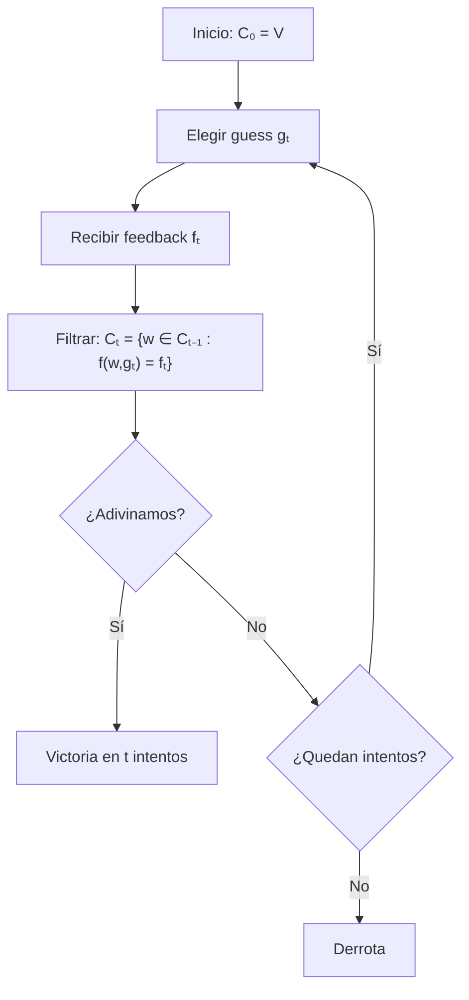

# El Juego de Wordle

## Origen y atractivo

Wordle es un juego de adivinanza de palabras creado por Josh Wardle en 2021 que se volvió viral. La mecánica es simple: tienes 6 intentos para adivinar una palabra secreta de 5 letras. Después de cada intento, recibes feedback por posición indicando qué tan cerca estuviste.

La simplicidad de las reglas esconde una riqueza estratégica profunda — y esa riqueza tiene que ver directamente con **teoría de la información**.

## Reglas formales

Sea:

- $L$ la longitud de la palabra (típicamente $L = 5$)
- $\mathcal{A}$ el alfabeto (letras minúsculas sin acentos)
- $\mathcal{V} \subseteq \mathcal{A}^L$ el vocabulario de palabras válidas
- $s \in \mathcal{V}$ la palabra secreta
- $g \in \mathcal{V}$ un intento (guess)

Después de cada intento $g$, recibes un vector de feedback $f \in \{0, 1, 2\}^L$ donde:

| Código | Color | Significado |
|:------:|-------|------------|
| 2 | Verde | Letra correcta en posición correcta |
| 1 | Amarillo | Letra correcta en posición incorrecta |
| 0 | Gris | Letra no presente (o ya consumida) |

### La función de feedback

El feedback es una función determinista:

$$f: \mathcal{V} \times \mathcal{V} \to \{0, 1, 2\}^L, \quad f(s, g)$$

Crucialmente: el feedback maneja **letras repetidas** de forma no trivial. Las verdes se asignan primero (consumen una aparición de la letra en el secreto), y luego las amarillas se asignan con las apariciones restantes.

### Ejemplo

Secreto: `CANTO`, guess: `ARCOS`

| Posición | Secreto | Guess | Feedback |
|:--------:|:-------:|:-----:|:--------:|
| 1 | C | A | 🟨 (A está en CANTO, pero no en pos. 1) |
| 2 | A | R | ⬛ (R no está en CANTO) |
| 3 | N | C | 🟨 (C está en CANTO, pero no en pos. 3) |
| 4 | T | O | 🟨 (O está en CANTO, pero no en pos. 4) |
| 5 | O | S | ⬛ (S no está en CANTO) |

## Estructura de información

¿Qué **sabes** después de un intento? Sabes que la palabra secreta es **consistente** con todos los feedbacks observados. Formalmente, sea $\mathcal{C}_t$ el conjunto de candidatos después de $t$ intentos:

$$\mathcal{C}_0 = \mathcal{V}$$

$$\mathcal{C}_t = \{w \in \mathcal{C}_{t-1} : f(w, g_t) = f_t\}$$

El conjunto se contrae con cada intento. El juego termina cuando $|\mathcal{C}_t| = 1$ (o cuando adivinamos la respuesta).

## ¿Por qué es un problema de teoría de la información?

Cada intento es una **pregunta** que particiona el espacio de candidatos. El feedback divide $\mathcal{C}_{t-1}$ en grupos según el patrón que producirían:

$$\mathcal{C}_{t-1} = \bigsqcup_{f \in \mathcal{F}} \{w \in \mathcal{C}_{t-1} : f(w, g) = f\}$$

Una buena pregunta produce muchos grupos de tamaño similar (distribución plana). Una mala pregunta produce un grupo enorme y varios vacíos (distribución concentrada).

Esto es exactamente lo que mide la **entropía**: la "planitud" de una distribución. Maximizar la entropía del feedback es maximizar la información esperada por intento.

## Flujo del juego

## Conexión con el módulo

Este juego es la versión concreta del ejemplo que hemos construido durante todo el módulo:

> Una caja negra elige una palabra secreta. Tú haces intentos y recibes feedback. ¿Cómo cuantificas tu progreso? ¿Cómo eliges el siguiente intento?

Las secciones que siguen presentan estrategias progresivamente más sofisticadas para responder estas preguntas.

---

**Siguiente:** [Estrategia aleatoria →](02_estrategia_aleatoria.md)

**Volver:** [← Índice del proyecto](00_index.md)
