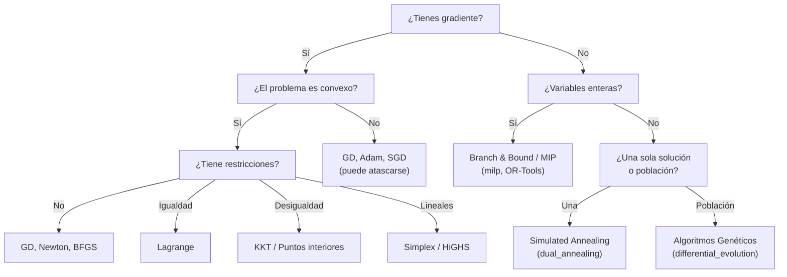

# Algoritmos de optimización: intuiciones

Esta sección da una vista panorámica de los algoritmos más importantes. No vamos a derivar nada formalmente — la meta es construir **intuición** sobre cuándo y por qué funciona cada método.

---

## Descenso de gradiente (sin restricciones)

La idea más simple y poderosa: **camina cuesta abajo**.

$$x_{k+1} = x_k - \alpha \nabla f(x_k)$$

donde $\alpha > 0$ es el **learning rate** (tasa de aprendizaje).

### Intuición

- $\nabla f(x_k)$ apunta en la dirección de **mayor crecimiento** de $f$.
- El negativo $-\nabla f(x_k)$ apunta "cuesta abajo".
- $\alpha$ controla el tamaño del paso.

### El learning rate importa mucho

| $\alpha$ muy pequeño | $\alpha$ muy grande |
|---|---|
| Convergencia lenta pero segura | Puede divergir (oscilar o explotar) |
| Muchos pasos para llegar | Pocos pasos pero inestable |

### Criterios de convergencia — ¿cuándo parar?

Descenso de gradiente es iterativo: ¿cómo sabemos que ya llegamos? Tres criterios comunes:

1. **Norma del gradiente:** $\|\nabla f(x_k)\| < \varepsilon$ — "el terreno es casi plano"
2. **Cambio en la función:** $|f(x_{k+1}) - f(x_k)| < \varepsilon$ — "ya no mejoramos"
3. **Cambio en parámetros:** $\|x_{k+1} - x_k\| < \varepsilon$ — "ya no nos movemos"

En `scipy.optimize.minimize`, estos criterios **se reflejan** (dependiendo del método) en tolerancias como `gtol`, `ftol` y `xtol`. En la práctica, SciPy combina varios criterios y algunos métodos ignoran ciertas tolerancias.

En la práctica de ML, es común usar un **número fijo de épocas** (por ejemplo, "entrena 100 épocas"). Esto no es principiado — puedes estar parando demasiado pronto o demasiado tarde — pero es simple y predecible.

### Supuestos formales

- $f$ es **diferenciable** (necesitamos $\nabla f$)
- El gradiente es **Lipschitz continuo** con constante $L$: $\|\nabla f(x) - \nabla f(y)\| \leq L\|x - y\|$
- Para garantía de óptimo global: $f$ es **convexa**
- Para tasa de convergencia lineal: $f$ es **fuertemente convexa** ($\mu > 0$)

### Ventajas y desventajas

| Ventajas | Desventajas |
|----------|-------------|
| Simple: $O(n)$ por iteración | Ignora curvatura (solo primer orden) |
| Convergencia garantizada si $f$ es convexa y $\alpha < 2/L$ | Sensible al learning rate |
| Base de todos los optimizadores de deep learning | Se atasca en mínimos locales (no convexo) |
| Fácil de implementar y paralelizar | Lento en problemas mal condicionados |

### Dónde se usa

- Entrenamiento de modelos lineales (regresión, clasificación)
- Base de todos los optimizadores de DL (SGD, Adam, AdaGrad)
- Cualquier problema diferenciable sin restricciones como primer intento

> **Notebook — Abre NB2, Secciones 1-3: GD y learning rates**
> 
>
> 1. Ejecuta GD en la cuadrática con `lr=0.08`. ¿Cuántos pasos necesita para converger?
> 2. Prueba `lr=0.33` vs `lr=0.34` en $f(x,y) = 3x^2 + y^2$. ¿Qué pasa?
> 3. El learning rate crítico es $\alpha_{\text{crit}} = 2/L_{\max}$ donde $L_{\max}$ es el eigenvalor más grande del Hessiano. Para $3x^2 + y^2$, $L_{\max} = 6$, así que $\alpha_{\text{crit}} = 1/3 \approx 0.333$.

---

## Descenso de gradiente estocástico (SGD)

En ML, la función objetivo es típicamente una **suma** sobre datos:

$$f(x) = \frac{1}{N} \sum_{i=1}^{N} f_i(x)$$

El gradiente completo es costoso: hay que evaluar $f_i$ para **cada** dato. Con millones de muestras, una sola iteración de GD es prohibitiva.

**Idea de SGD:** El gradiente completo es una **esperanza**: $\nabla f(x) = \mathbb{E}_i[\nabla f_i(x)]$. Podemos estimarlo con un subconjunto aleatorio (**mini-batch**) de $B$ muestras:

$$x_{k+1} = x_k - \alpha \frac{1}{|B|} \sum_{i \in B} \nabla f_i(x_k)$$

El gradiente estimado es ruidoso, pero en promedio apunta en la dirección correcta.

### ¿Por qué funciona el ruido?

- **Ventaja:** El ruido ayuda a **escapar puntos silla** y mínimos locales poco profundos. Un gradiente ruidoso puede "sacudir" al algoritmo fuera de una trampa (recuerda la discusión de puntos silla en la [sección de paisaje](02_paisaje_y_conceptos.md)).
- **Costo:** La convergencia es más ruidosa — la trayectoria zigzaguea en lugar de descender suavemente.

### Learning rate schedules

Con SGD, el learning rate importa aún más:
- **Constante:** simple pero puede oscilar eternamente cerca del óptimo
- **Decay:** $\alpha_k = \alpha_0 / (1 + k \cdot d)$ — reduce el ruido gradualmente
- **Warmup:** empieza pequeño, sube, y luego baja — estabiliza el inicio del entrenamiento

### Adam: el optimizador por defecto

### Adam: el optimizador por defecto en deep learning

**Adam** (Adaptive Moment Estimation) adapta el learning rate **por parámetro** usando estimados del primer y segundo momento del gradiente. Intuitivamente: parámetros con gradientes consistentes reciben pasos grandes; parámetros con gradientes erráticos reciben pasos pequeños.

La regla de actualización:

$$m_t = \beta_1 m_{t-1} + (1 - \beta_1) g_t \qquad \text{(media móvil del gradiente)}$$

$$v_t = \beta_2 v_{t-1} + (1 - \beta_2) g_t^2 \qquad \text{(media móvil del gradiente}^2\text{)}$$

$$\hat{m}_t = \frac{m_t}{1 - \beta_1^t}, \quad \hat{v}_t = \frac{v_t}{1 - \beta_2^t} \qquad \text{(corrección de sesgo)}$$

$$\theta_{t+1} = \theta_t - \frac{\alpha}{\sqrt{\hat{v}_t} + \varepsilon} \hat{m}_t$$

Valores por defecto: $\beta_1 = 0.9$, $\beta_2 = 0.999$, $\varepsilon = 10^{-8}$. Adam es el optimizador por defecto en deep learning moderno, aunque **no** tiene garantía de convergencia en todos los casos convexos (a diferencia de SGD con decay).

### Supuestos formales (SGD/Adam)

- La función objetivo tiene estructura de **suma**: $f = \frac{1}{N}\sum f_i$
- El gradiente del mini-batch es un **estimador insesgado**: $\mathbb{E}[\nabla f_B] = \nabla f$
- La varianza del gradiente es **acotada**: $\text{Var}[\nabla f_B] \leq \sigma^2$
- Para convergencia teórica de SGD: learning rate decreciente ($\sum \alpha_k = \infty$, $\sum \alpha_k^2 < \infty$)

### Ventajas y desventajas

| Ventajas | Desventajas |
|----------|-------------|
| $O(B)$ por iteración (no depende de $N$) | Convergencia ruidosa |
| Escala a miles de millones de muestras | Necesita schedule de learning rate |
| El ruido ayuda a escapar puntos silla | Oscila con learning rate constante |
| Adam adapta lr por parámetro automáticamente | Adam: sin garantía de convergencia en todos los casos convexos |

### Dónde se usa

- **Todo** entrenamiento de redes neuronales (CNNs, transformers, LLMs)
- Sistemas de recomendación a gran escala
- Cualquier problema donde $N$ es tan grande que el gradiente completo es prohibitivo

> **Notebook — Abre NB2, Sección SGD: SGD vs batch GD**
> 
>
> 1. Compara las curvas de convergencia de GD completo vs SGD en regresión lineal sintética.
> 2. ¿Cuál converge más rápido en tiempo de reloj? ¿Cuál tiene trayectoria más suave?
> 3. Cambia el tamaño del mini-batch. ¿Qué pasa con batch_size=1 vs batch_size=N?

---

## Métodos de segundo orden — intuición

Descenso de gradiente usa información de **primer orden** (la pendiente). ¿Qué pasa si también usamos la **curvatura**?

### Newton's method

El método de Newton usa el **Hessiano** $H$ (matriz de segundas derivadas) para tomar pasos más inteligentes:

$$x_{k+1} = x_k - H^{-1} \nabla f(x_k)$$

**Intuición:** GD camina a velocidad constante en todas las direcciones. Newton toma pasos **grandes en direcciones planas** (poca curvatura) y **pequeños en direcciones empinadas** (mucha curvatura). Es como ajustar el learning rate automáticamente por dirección.

### El problema: el costo

Calcular $H^{-1}$ cuesta $O(n^3)$ donde $n$ es el número de parámetros. Para una red neuronal con millones de parámetros, esto es imposible.

### L-BFGS: lo mejor de dos mundos

**L-BFGS** (Limited-memory BFGS) **aproxima** $H^{-1}$ usando solo el historial reciente de gradientes. No requiere calcular el Hessiano completo — solo guarda los últimos ~10 gradientes y hace una aproximación.

Por eso `scipy.optimize.minimize` con `method='L-BFGS-B'` destruye a nuestro GD casero en Rosenbrock: usa información de curvatura aproximada para navegar el valle banana eficientemente.

### Supuestos formales (Newton)

- $f$ es **dos veces diferenciable**
- El Hessiano $H$ es **invertible** y **positivo definido** (al menos cerca del óptimo)
- Hessiano Lipschitz para convergencia **cuadrática**
- $x_0$ debe estar **cerca del óptimo** (convergencia local, no global)

### Ventajas y desventajas (Newton)

| Ventajas | Desventajas |
|----------|-------------|
| Convergencia **cuadrática** (extremadamente rápida cerca del óptimo) | $O(n^3)$ por iteración (inversión del Hessiano) |
| No necesita learning rate | Diverge lejos del óptimo |
| Invariante al condicionamiento del problema | Necesita $H$ positivo definido |

### Supuestos formales (L-BFGS-B)

- $f$ tiene **gradiente suave** (diferenciable)
- Almacena $m \sim 10$ pares de gradientes para aproximar $H^{-1}$

### Ventajas y desventajas (L-BFGS-B)

| Ventajas | Desventajas |
|----------|-------------|
| Convergencia quasi-Newton a costo $O(mn)$ | Necesita gradiente suave |
| Maneja cotas (bounds) en variables | No apto para settings estocásticos |
| Default de `scipy.optimize.minimize` | Menos robusto que Newton puro cerca del óptimo |

### Dónde se usan (segundo orden)

- **Newton:** Calibración de modelos pequeños/medianos, optimización de portafolios, computación científica
- **L-BFGS-B:** Default de scipy, regresión logística en scikit-learn, modelos de NLP con features clásicas

> **Notebook — Abre NB2, Secciones 4 y 6: Rosenbrock**
> 
>
> 1. Ejecuta GD en Rosenbrock con 5000 pasos. ¿Qué tan cerca llega del óptimo (1,1)?
> 2. Compara con `scipy.optimize.minimize` (L-BFGS-B). ¿Cuántas evaluaciones necesita?
> 3. ¿Por qué L-BFGS-B gana? Porque usa información de curvatura (segundo orden).

---

## Multiplicadores de Lagrange (restricciones de igualdad)

¿Cómo minimizas $f(x)$ cuando $x$ debe estar sobre una superficie $h(x) = 0$?

**Intuición geométrica:** en el óptimo, el gradiente de $f$ es **paralelo** al gradiente de $h$. Si no fueran paralelos, podrías moverte a lo largo de la restricción y seguir bajando.

$$\nabla f(x^{∗}) = \lambda \nabla h(x^{∗})$$

Esto se formaliza con el **Lagrangiano**:

$$\mathcal{L}(x, \lambda) = f(x) + \lambda \, h(x)$$

El óptimo se encuentra resolviendo $\nabla_x \mathcal{L} = 0$ y $\nabla_\lambda \mathcal{L} = 0$ (que equivale a $h(x) = 0$).

### Ejemplo trabajado

$\min \quad x^2 + y^2 \quad$ sujeto a $\quad x + y = 1$

Lagrangiano: $\mathcal{L}(x, y, \lambda) = x^2 + y^2 + \lambda(x + y - 1)$

<strong>Ver Solución</strong>

Condiciones de primer orden:

$$
\begin{aligned}
\frac{\partial \mathcal{L}}{\partial x} &= 2x + \lambda = 0 \quad \Rightarrow \quad x = -\lambda/2 \\
\frac{\partial \mathcal{L}}{\partial y} &= 2y + \lambda = 0 \quad \Rightarrow \quad y = -\lambda/2 \\
\frac{\partial \mathcal{L}}{\partial \lambda} &= x + y - 1 = 0
\end{aligned}
$$

De las dos primeras: $x = y$. Sustituyendo en la tercera: $2x = 1 \Rightarrow x = y = 1/2$.

Solución: $(x^{∗}, y^{∗}) = (1/2, 1/2)$, con $f^{∗} = 1/2$.

**Conexión con módulo 06:** Los multiplicadores de Lagrange aparecen también en la derivación de la distribución de máxima entropía (MaxEnt de Jaynes). Allí, maximizas entropía sujeto a restricciones de momentos — exactamente la misma estructura.

### Supuestos formales

- $f$ y $h_i$ son **diferenciables**
- **LICQ** (Linear Independence Constraint Qualification): los gradientes de las restricciones activas son linealmente independientes
- Suficiencia de segundo orden para confirmar que es un mínimo (no máximo ni silla)

### Ventajas y desventajas

| Ventajas | Desventajas |
|----------|-------------|
| Da soluciones **analíticas** para problemas pequeños | Solo maneja restricciones de **igualdad** |
| Interpretación económica: $\lambda$ es el **precio sombra** | Difícil de resolver analíticamente en alta dimensión |
| Fundamento de dualidad (SVM, MaxEnt) | No aplica directamente a desigualdades |

### Dónde se usa

- Derivación de **MaxEnt** (módulo 06)
- Formulación del **dual de SVM**
- Economía (maximización de utilidad con restricción de presupuesto)
- Física (mecánica analítica, principio de mínima acción)

> **Notebook — Abre NB2: Lagrange**
> 
>
> 1. Verifica que scipy confirma la solución analítica $(0.5, 0.5)$.
> 2. Cambia la restricción a $x + y = 2$. ¿Cómo cambia la solución?
> 3. Observa los contornos: el óptimo está donde la restricción es **tangente** a una curva de nivel.

---

## Condiciones KKT (restricciones de desigualdad)

Las condiciones de **Karush-Kuhn-Tucker** extienden Lagrange a restricciones de desigualdad $g_j(x) \leq 0$.

**Intuición:** "Lagrange + restricciones activas/inactivas".

El Lagrangiano generalizado es:

$$\mathcal{L}(x, \lambda, \mu) = f(x) + \sum_i \lambda_i h_i(x) + \sum_j \mu_j g_j(x)$$

Las condiciones KKT agregan una condición clave — **holgura complementaria**:

$$\mu_j \, g_j(x) = 0 \quad \text{para todo } j$$

Esto dice: para cada restricción de desigualdad, o la restricción está **activa** ($g_j = 0$, y $\mu_j$ puede ser positivo) o está **inactiva** ($g_j < 0$, y $\mu_j = 0$, "no importa"). Nunca ambas.

### Las 4 condiciones KKT

Para el problema $\min f(x)$ s.t. $g_j(x) \leq 0$, $h_i(x) = 0$:

1. **Estacionariedad:** $\nabla f(x^{∗}) + \sum_i \lambda_i \nabla h_i(x^{∗}) + \sum_j \mu_j \nabla g_j(x^{∗}) = 0$
2. **Factibilidad primal:** $h_i(x^{∗}) = 0$, $g_j(x^{∗}) \leq 0$
3. **Factibilidad dual:** $\mu_j \geq 0$
4. **Holgura complementaria:** $\mu_j g_j(x^{∗}) = 0$

### Ejemplo trabajado: el problema de transporte (capstone)

Consideremos $\min 2x_1^2 + 3x_2^2 + x_1 x_2$ sujeto a $-(x_1 + x_2 - 10) \leq 0$ (es decir, $x_1 + x_2 \geq 10$), con $x_1, x_2 \geq 0$.

<strong>Ver las 4 condiciones KKT</strong>

Reescribimos: $g(x) = -(x_1 + x_2 - 10) = -x_1 - x_2 + 10 \leq 0$

1. **Estacionariedad:** $\nabla f + \mu \nabla g = 0$
   - $4x_1 + x_2 - \mu = 0$
   - $6x_2 + x_1 - \mu = 0$

2. **Factibilidad primal:** $-x_1 - x_2 + 10 \leq 0$ → $x_1 + x_2 \geq 10$

3. **Factibilidad dual:** $\mu \geq 0$

4. **Holgura complementaria:** $\mu(-x_1 - x_2 + 10) = 0$

Si la restricción está **activa** ($x_1 + x_2 = 10$), de (1): $4x_1 + x_2 = 6x_2 + x_1$ → $3x_1 = 5x_2$ → $x_1 = 6.25$, $x_2 = 3.75$, $\mu = 28.75 > 0$ ✓

### Supuestos formales

- $f$, $g_j$, $h_i$ son **diferenciables**
- **Condición de Slater** (caso convexo): existe un punto estrictamente factible para las desigualdades
- En el caso general: **LICQ** u otra calificación de restricciones
- $\mu_j \geq 0$ para todas las desigualdades

### Dónde se usa

- **Métodos de puntos interiores** (solvers modernos de LP/QP)
- Derivación de la formulación **dual de SVM**
- Fundamento teórico de todo solver con restricciones de desigualdad

---

## Método simplex (programación lineal)

Para problemas lineales ($\min c^T x$ sujeto a $Ax \leq b$, $x \geq 0$), hay una estructura especial:

- La **región factible** es un **politopo** (poliedro acotado).
- El **óptimo siempre está en un vértice** del politopo.

El **método simplex** (Dantzig, 1947) camina de vértice en vértice, siempre mejorando el objetivo, hasta llegar al óptimo. Es extraordinariamente eficiente en la práctica, aunque teóricamente puede ser exponencial en el peor caso.

### Supuestos formales

- Objetivo y restricciones son **lineales**
- La región factible es **no vacía y acotada** (o al menos el óptimo existe)

### Ventajas y desventajas

| Ventajas | Desventajas |
|----------|-------------|
| Solución **exacta** (no aproximada) | Solo problemas lineales |
| Muy rápido en la práctica | Peor caso exponencial |
| Décadas de implementaciones maduras (HiGHS, CPLEX, Gurobi) | Degeneración puede causar ciclado |

### Dónde se usa

- Logística y transporte (ruteo, asignación)
- Planificación de producción
- Scheduling de aerolíneas
- Asignación de recursos en telecomunicaciones

> **Notebook — Abre NB2: `linprog`**
> 
>
> 1. Resuelve el problema de producción con `linprog`. La solución está en un vértice.
> 2. Cambia `b_ub` (recursos disponibles). ¿La solución se mueve a otro vértice?
> 3. Cambia `c` (ganancias). ¿La solución salta a un vértice diferente?

---

## Metaheurísticas: cuando no hay gradiente

A veces no puedes (o no quieres) calcular gradientes: la función es ruidosa, discontinua, o de caja negra. Ahí entran las **metaheurísticas** — algoritmos que solo necesitan evaluar $f(x)$, no su derivada.

---

## Simulated Annealing (recocido simulado)

### Intuición

Imagina que buscas el punto más bajo de una cordillera **de noche** (no puedes ver el paisaje completo). Al principio saltas a sitios aleatorios — incluso si son más altos — para explorar. Conforme pasa el tiempo, te vuelves más selectivo: solo aceptas movimientos que bajan. Este balance entre **exploración** (alta temperatura) y **explotación** (baja temperatura) es la esencia de SA.

El nombre viene de la metalurgia: al calentar un metal y enfriarlo lentamente, los átomos encuentran configuraciones de baja energía. Si enfrías demasiado rápido, el metal queda frágil (mínimo local); enfriando lento, encuentras la estructura cristalina óptima (mínimo global).

### Algoritmo

1. Elige un punto inicial $x_0$ y una temperatura inicial $T_0$ alta
2. **Genera vecino:** $x' = x + \text{perturbación aleatoria}$
3. **Calcula** $\Delta = f(x') - f(x)$
4. **Decide:**
   - Si $\Delta < 0$ (mejora): acepta $x' $ siempre
   - Si $\Delta \geq 0$ (empeora): acepta con probabilidad $p = e^{-\Delta / T}$ (criterio de Metropolis)
5. **Enfría:** $T \leftarrow \alpha \cdot T$ (típicamente $\alpha \in [0.9, 0.999]$)
6. **Repite** hasta que $T$ sea suficientemente baja o se agoten las iteraciones

### Supuestos formales

- Solo necesitas evaluar $f(x)$ — **caja negra** (no gradiente)
- La vecindad debe ser **ergódica**: desde cualquier punto, eventualmente puedes llegar a cualquier otro
- Convergencia teórica al global **solo** con enfriamiento logarítmico ($T_k \propto 1/\log k$), que es imprácticamente lento

### Ventajas y desventajas

| Ventajas | Desventajas |
|----------|-------------|
| No necesita gradiente | Más lento que métodos de gradiente cuando estos aplican |
| Escapa mínimos locales (al inicio) | Sensible al schedule de temperatura ($T_0$, $\alpha$) |
| Simple de implementar (~20 líneas) | Un solo agente (no paralelizable trivialmente) |
| Funciona con funciones discontinuas, ruidosas, combinatorias | Sin garantía práctica de convergencia |

### Dónde se usa

- Diseño de circuitos VLSI (placement & routing)
- Problema del viajante (TSP)
- Scheduling y planificación
- Calibración de modelos de simulación
- En scipy: `scipy.optimize.dual_annealing` (versión mejorada)

> **Notebook — Abre NB2, Secciones SA**
> 
>
> 1. Implementa SA desde cero en la función de Rastrigin (muchos mínimos locales, global en el origen).
> 2. Visualiza la trayectoria, la temperatura, y la convergencia.
> 3. Varía $T_0$ y $\alpha$. ¿Qué pasa si enfrías muy rápido?
> 4. Compara con `scipy.optimize.dual_annealing`.

---

## Algoritmos Genéticos (GA)

### Intuición

Imagina una **población de soluciones** que evoluciona. Las mejores soluciones ("las más aptas") tienen más probabilidad de reproducirse. Al combinar dos buenas soluciones (crossover) y agregar variación aleatoria (mutación), la población mejora generación tras generación. Después de muchas generaciones, la mejor solución de la población está cerca del óptimo global.

### Algoritmo

1. **Inicializa** una población de $N$ soluciones aleatorias
2. **Evalúa** fitness (= $f(x)$) de cada individuo
3. **Selección:** elige padres con probabilidad proporcional a su fitness (o por torneo)
4. **Crossover:** combina dos padres para crear hijos (mezcla de sus "genes")
5. **Mutación:** perturba algunos hijos aleatoriamente (diversidad)
6. **Reemplazo:** la nueva generación reemplaza a la anterior (con **elitismo**: el mejor individuo siempre sobrevive)
7. **Repite** desde el paso 2 por $G$ generaciones

### Supuestos formales

- Solo necesitas evaluar fitness — **caja negra** (igual que SA)
- Necesitas una representación adecuada del individuo ("cromosoma") para el problema
- Los operadores de crossover y mutación deben ser **compatibles** con la representación
- **Elitismo** (conservar al mejor) garantiza que el fitness nunca empeora entre generaciones

### Ventajas y desventajas

| Ventajas | Desventajas |
|----------|-------------|
| La población explora **en paralelo** (múltiples regiones) | Muchas evaluaciones de $f$ ($N \times G$) |
| Natural para problemas discretos/combinatorios | Muchos hiperparámetros ($N$, $p_m$, tipo de selección, crossover) |
| Robusto ante ruido y multimodalidad | Ignora estructura del problema |
| No necesita gradiente | Lento para funciones suaves donde GD gana |

### Dónde se usa

- Diseño de antenas (NASA usó GA para optimizar la antena de la misión ST5)
- Scheduling y planificación combinatoria
- **Neural Architecture Search** (NAS): buscar la mejor arquitectura de red neuronal
- Optimización de portafolios con restricciones complejas
- En scipy: `scipy.optimize.differential_evolution` (variante evolutiva)

> **Notebook — Abre NB2, Secciones GA**
> 
>
> 1. Implementa un GA desde cero en Rastrigin 2D.
> 2. Visualiza cómo la población evoluciona y converge.
> 3. Varía `pop_size` y `mutation_rate`. ¿Más población = mejor resultado?
> 4. Compara con `scipy.optimize.differential_evolution`.

---

## Comparación: todos los métodos en el mismo problema

¿Qué pasa cuando ponemos **todos** los métodos a competir en la misma función? La función de Rastrigin es perfecta para esto: tiene muchos mínimos locales, así que los métodos de gradiente se atascan, mientras que las metaheurísticas pueden encontrar el global.

| Método | ¿Necesita gradiente? | ¿Encuentra el global? | Evaluaciones |
|--------|:-------------------:|:--------------------:|:------------:|
| GD | Sí | No (se atasca en local) | ~2000 |
| L-BFGS-B | Sí | No (se atasca en local) | ~50 |
| SA (custom) | No | A veces | ~6000 |
| GA (custom) | No | A veces | ~6000 |
| `dual_annealing` | No | Sí (casi siempre) | ~2000-5000 |
| `differential_evolution` | No | Sí (casi siempre) | ~3000-5000 |

**Regla práctica:**
- Si tienes gradiente y el problema es convexo → **GD/L-BFGS-B** (rápido, garantizado)
- Si tienes gradiente y no es convexo → **SGD/Adam** (puede escapar sillas)
- Si no tienes gradiente → **`dual_annealing`** o **`differential_evolution`** de scipy
- Si el problema es discreto/combinatorio → **GA** o **SA**

> **Notebook — Abre NB2, Sección Comparación**
> 
>
> 1. Ejecuta **todos** los métodos en Rastrigin desde el mismo punto inicial.
> 2. ¿Cuáles encuentran el mínimo global? ¿Cuántas evaluaciones necesitan?
> 3. ¿Qué método elegirías en la práctica?

---

## Taxonomía de algoritmos

---

:::exercise{title="Ejercicio: Empareja algoritmo con problema" difficulty="1"}

Empareja cada problema con el algoritmo más apropiado:

| Problema | Algoritmo |
|----------|-----------|
| 1. $\min c^T x$ s.t. $Ax \leq b$ | a. Descenso de gradiente |
| 2. Entrenar una red neuronal | b. Simplex |
| 3. $\min f(x)$ s.t. $h(x) = 0$, $f$ y $h$ diferenciables | c. Simulated annealing |
| 4. Optimizar una función de caja negra ruidosa | d. Multiplicadores de Lagrange |
| 5. $\max \sum v_i x_i$ s.t. $\sum w_i x_i \leq W$, $x_i \in \{0,1\}$ | e. MIP (milp) |
| 6. Encontrar la mejor arquitectura de red neuronal | f. Algoritmo genético |

<strong>Ver Solución</strong>

1 → b (Simplex: problema lineal)
2 → a (Descenso de gradiente / SGD / Adam: sin restricciones, con gradiente)
3 → d (Lagrange: restricción de igualdad, diferenciable)
4 → c (Simulated annealing: sin gradiente, función de caja negra)
5 → e (MIP: variables binarias con restricciones lineales — es el problema de la mochila)
6 → f (Algoritmo genético / NAS: espacio de búsqueda discreto y combinatorio)

:::

---

**Siguiente:** [Ejemplos en Python →](04_ejemplos_python.md)
