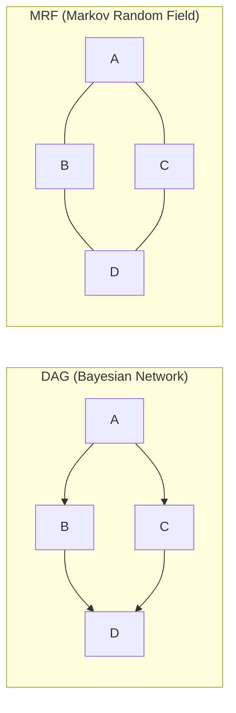
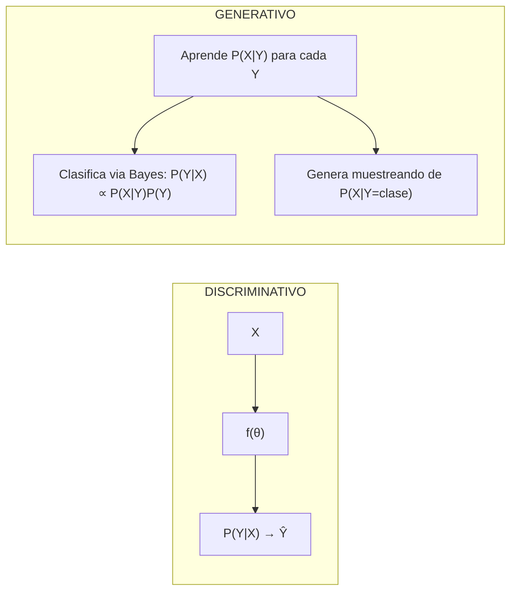
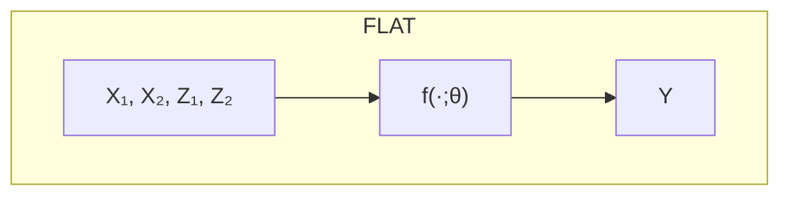
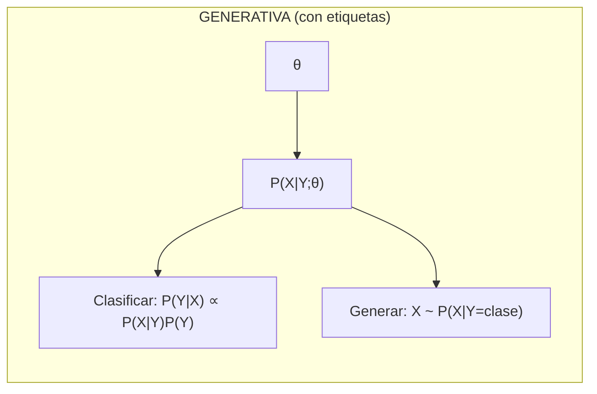
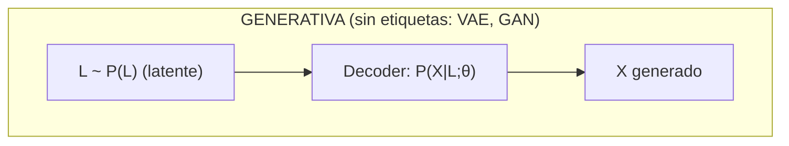
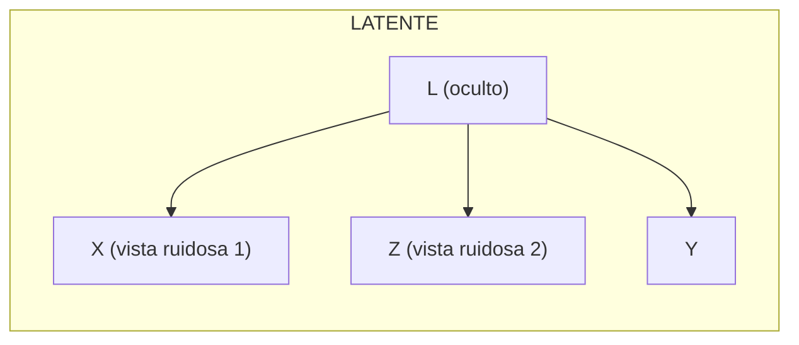
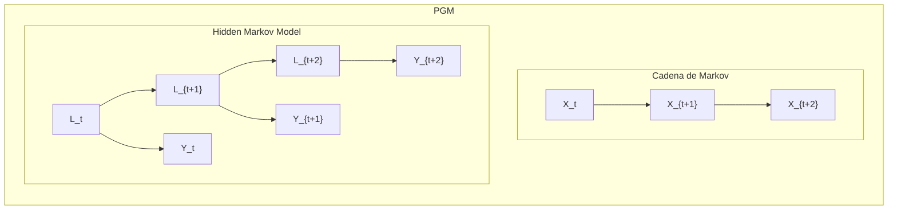
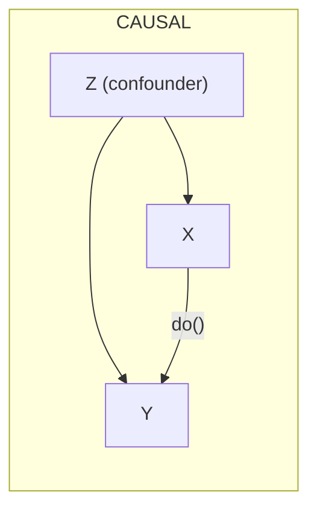
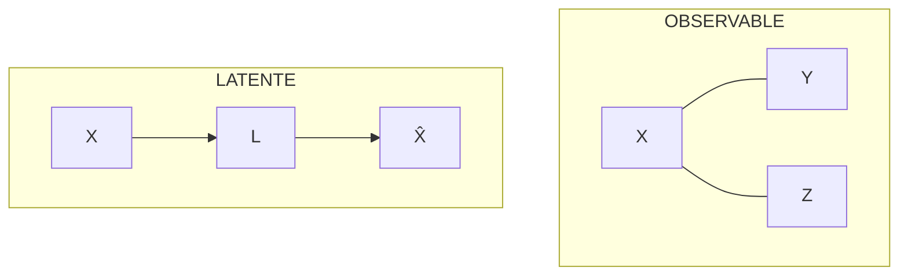

# D4: Arquitectura de Variables y D5: Supuestos Inductivos

## Dimensión 4: Arquitectura de Variables

*Las variables no son islas. O sí lo son — y esa es una decisión.*

**Pregunta clave**: *"¿Las variables solo se usan como inputs, o tienen una relación estructural específica entre ellas?"*

### Terminología de grafos

| Término | Significado | Visualización |
|---------|-------------|---------------|
| **DAG** | Directed Acyclic Graph (grafo dirigido sin ciclos) | A → B → C (flechas, no puedes volver al inicio) |
| **MRF** | Markov Random Field (grafo no dirigido) | A — B — C (conexiones sin dirección) |
| **PGM** | Probabilistic Graphical Model (término general) | Incluye DAGs (Bayesian Networks) y MRFs |



### Las 5 arquitecturas

| Arquitectura | Estructura | Supuesto implícito | Mejor para | Situación real |
|--------------|------------|-------------------|------------|----------------|
| **Flat/Discriminativa** | $[X, Z] \to Y$ | Variables son intercambiables como inputs | Alta precisión con muchos datos | *Clasificación de spam*: todas las features son inputs equivalentes |
| **Generativa** | Modelo de $P(X,Z)$ junto con Y | El mundo tiene estructura que podemos simular | Datos faltantes, generación | *Generar rostros*: necesitas entender cómo se distribuyen los pixels |
| **Latente** | X,Z son vistas ruidosas de $L$ oculto | La realidad es más simple que las observaciones | Ruido, fusión de sensores | *GPS + acelerómetro*: ambos miden posición real con ruido diferente |
| **Grafos/PGM** | DAG o MRF de dependencias | Independencias condicionales explícitas | Interpretabilidad, conocimiento experto | *Diagnóstico médico*: síntomas dependen de enfermedad, no entre sí |
| **Causal** | DAG con dirección causal | Mecanismos son estables bajo intervención | Decisiones, robustez OOD | *Política pública*: ¿subir impuestos CAUSA menos consumo? |

### Discriminativo vs Generativo — La distinción clave

| Enfoque | Qué modela | Pregunta que responde | ¿Puede generar datos nuevos? |
|---------|------------|----------------------|------------------------------|
| **Discriminativo** | $P(Y \mid X)$ | "Dado este input X, ¿cuál es Y?" | No directamente |
| **Generativo** | $P(X)$ o $P(X,Y)$ | "¿Cómo se ven los datos?" | Sí, muestreando de $P(X)$ |

:::example{title="Clasificar gatos vs perros"}
- **Discriminativo** (ej: Logistic Regression, SVM): Aprende la frontera de decisión entre gatos y perros. No sabe "cómo se ve un gato", solo sabe distinguirlos.
- **Generativo** (ej: Naive Bayes, Gaussian Mixture): Aprende $P(X \mid \text{gato})$ y $P(X \mid \text{perro})$ — cómo se ven los gatos, cómo se ven los perros. Puede generar imágenes nuevas Y clasificar usando Bayes.
:::




### Dos significados de "Generativo"

El término "generativo" se usa en ML con dos significados que a veces se confunden:

| Significado | Definición | Ejemplo |
|-------------|------------|---------|
| **Arquitectura generativa** (clásico) | Modelar $P(X)$ o $P(X,Y)$ en lugar de solo $P(Y \mid X)$ | Naive Bayes, Gaussian Mixture, VAE |
| **IA Generativa** (moderno) | Cualquier modelo capaz de **generar contenido nuevo** | GPT, Stable Diffusion, DALL-E |

:::example{title="GPT y la regla de la cadena"}
¿Por qué la confusión? Un LLM como GPT modela **P(Xₜ₊₁\|X₁:ₜ)**, que técnicamente es condicional (discriminativo en cierto sentido). Pero al encadenar estas predicciones, genera secuencias completas de texto — por eso lo llamamos "generativo" en el sentido de capacidad.

```
P(X₂|X₁) × P(X₃|X₁,X₂) × P(X₄|X₁,X₂,X₃) × ... = P(X₁,X₂,X₃,X₄,...)
────────────────────────────────────────────────────────────────────
Predicciones condicionales encadenadas = Distribución conjunta P(X)
```

**En resumen**: GPT es generativo en **capacidad** (genera texto) aunque su objetivo inmediato sea condicional.
:::

### Visualización de arquitecturas

*Nota: **θ** (theta) representa los **parámetros del modelo** — los números que se aprenden/ajustan durante el entrenamiento (pesos, coeficientes, etc.)*













### ¿Qué arquitectura elegir?

| Situación | Arquitectura recomendada |
|-----------|--------------------------|
| Features intercambiables, sin estructura especial | Flat |
| Quieres generar datos nuevos | Generativa |
| Datos ruidosos de múltiples fuentes | Latente |
| Conoces dependencias entre variables | PGM/Grafo |
| Necesitas efectos causales | Causal |
| Datos secuenciales/temporales | PGM temporal (Markov, HMM) |
| Imágenes, texto, señales | Latente + arquitectura especializada |

> *Estas son heurísticas, no reglas. La elección óptima en esta dimensión depende de las otras cuatro — entender el sistema completo es más importante que optimizar cada eje por separado.*

---

## Dimensión 5: Supuesto Inductivo y Estructural

*Todo modelo hace supuestos sobre cómo funciona el mundo — sin ellos, generalizar sería imposible.*

Este eje captura **qué creencias estructurales** incorpora el modelo. En la literatura se conoce como:
- **Sesgo inductivo** (inductive bias) — término técnico en ML: es el conjunto de supuestos o creencias previas que un sistema —ya sea una persona o un modelo de aprendizaje automático— utiliza para generalizar a partir de datos limitados.Es la “idea previa” que guía cómo interpretamos la información cuando no tenemos todos los datos.
- **Prior** — término bayesiano para creencias previas
- **Restricción** — porque limita el espacio de hipótesis

Usamos "supuesto" porque enfatiza que es una **decisión filosófica** sobre la naturaleza del problema, no solo una técnica de regularización.

Miguel Ángel decía que la escultura ya existía dentro del mármol — él solo quitaba lo que sobraba. La predicción funciona igual: el espacio de modelos posibles es infinito, y tus supuestos determinan cuáles consideras plausibles.

Cada tipo de supuesto es un cincel diferente:
- La **arquitectura** asume ciertas invarianzas (espaciales, temporales)
- La **regularización** asume que funciones simples son más probables
- Los **priors** expresan creencias explícitas sobre parámetros
- La **validación** asume que el futuro se parecerá al pasado

**Pregunta clave**: *"Dado que tengo datos finitos, ¿qué supuesto estructural uso para elegir entre los infinitos modelos que ajustan los datos?"*

| Supuesto | Qué asume | Ejemplo | Situación real |
|----------|-----------|---------|----------------|
| **Arquitectura** | Limita qué funciones son representables | CNN (invarianza traslacional), Transformer (atención) | *Reconocimiento de objetos*: un gato es gato esté arriba o abajo de la imagen |
| **Penalización** | Castiga complejidad en la función de pérdida | L2 = funciones suaves, L1 = funciones sparse | *Regresión con muchas variables*: L1 fuerza a usar solo las importantes |
| **Prior probabilístico** | Distribución explícita sobre parámetros | Prior Gaussiano en pesos, GP kernel | *Pocos datos*: "creo que los parámetros están cerca de cero" |
| **Independencia condicional** | Asume que ciertas variables son independientes dadas otras | Propiedad de Markov, Naive Bayes, PGMs | *Markov*: el pasado lejano no importa dado el presente |
| **Calibración/Momentos** | Match de momentos/estadísticas observadas | SMM, GMM (Momentos Generalizados), calibración económica | *DSGE*: ajustar para que el modelo reproduzca volatilidad del PIB observada |
| **Validación cruzada** | Selección por performance en held-out | CV, train/val/test split | *Elegir hiperparámetros*: probar en datos que el modelo no vio |
| **Invarianza causal** | Solo usar relaciones estables bajo cambio de distribución | IRM, Causal regularization | *Modelo médico* que funcione igual en hospitales diferentes |

### Equivalencia Bayesiana

**Insight fundamental**:
Todo supuesto inductivo es matemáticamente equivalente a algún tipo de "prior" o creencia sobre qué funciones son más plausibles.

| Supuesto | Equivalencia Bayesiana |
|----------|------------------------|
| L2 regularization | Prior Gaussiano sobre pesos |
| L1 regularization | Prior Laplaciano sobre pesos |
| Dropout | Prior sobre redes sparse |
| CNN architecture | Prior de invarianza traslacional |
| Propiedad de Markov | Prior de independencia condicional temporal |
| Validación cruzada | Prior implícito de generalización |


### ¿Qué supuesto elegir?

| Situación | Supuesto recomendado |
|-----------|----------------------|
| Invarianza espacial conocida (imágenes) | Arquitectura (CNN) |
| Invarianza secuencial (texto, tiempo) | Arquitectura (Transformer, RNN) |
| Muchas features, pocas relevantes | Penalización L1 (sparsity) |
| Quieres funciones suaves | Penalización L2 |
| Conocimiento previo sobre parámetros | Prior probabilístico |
| Datos temporales | Propiedad de Markov |
| Modelo teórico con parámetros libres | Calibración/Momentos |
| No sabes qué supuesto usar | Validación cruzada |
| Modelo debe funcionar en múltiples contextos | Invarianza causal |

> *Estas son heurísticas, no reglas. La elección óptima en esta dimensión depende de las otras cuatro — entender el sistema completo es más importante que optimizar cada eje por separado.*

---

## El Rol de Z vs L (Variables Auxiliares y Latentes)

**Distinción fundamental:**
- **Z (observable)**: Información adicional que *tienes* en tus datos
- **L (latente)**: Representación oculta que *infiere* el modelo



### Roles de Z (variable auxiliar observable)

| Rol de Z | Descripción | Cómo se usa | Ejemplo |
|----------|-------------|-------------|---------|
| **Feature adicional** | Información extra para predecir Y | Concatenar con X: $P(Y \mid X,Z)$ | Predecir ventas: X=historial, Z=clima |
| **Proxy ruidoso de X** | Z mide lo mismo que X con error | Modelos de error de medición | Encuestas: respuesta observada Z vs opinión real X |
| **Vista alternativa** | X y Z son perspectivas del mismo objeto | Contrastive learning: $\phi(X) \approx \phi(Z)$ | Imagen y su descripción textual (CLIP) |
| **Confounder** | Variable que afecta tanto X como Y | Controlar/bloquear en análisis causal | Educación afecta tanto ingreso como salud |
| **Instrumento** | Variable que afecta Y solo a través de X | IV regression | Distancia a universidad como instrumento para educación |
| **Variable de agrupación** | Define subpoblaciones | Cobertura condicional en Conformal | Garantizar precisión por género/edad |

### Roles de L (variable latente)

| Rol de L | Descripción | Cómo se usa | Ejemplo |
|----------|-------------|-------------|---------|
| **Representación comprimida** | Embedding de dimensión menor | $\phi(X) \to L$ donde dim(L) < dim(X) | Autoencoder, PCA |
| **Estado oculto** | Variable no medida que genera observaciones | $P(X \mid L)$ donde L causa X | HMM: L=estado del sistema, X=mediciones |
| **Factor latente** | Causa común de múltiples observaciones | X, Z son vistas ruidosas de L | Factor Analysis: L=inteligencia, X,Z=tests |
| **Espacio generativo** | De donde se muestrean nuevos datos | $P(L)$ y $P(X \mid L)$ | VAE: L~N(0,I), luego decodificar a imagen |

---

**Anterior:** [Incertidumbre y objetivo (D2 + D3)](03_incertidumbre_y_objetivo.md) | **Siguiente:** [Atlas de métodos →](05_atlas_de_metodos.md)
