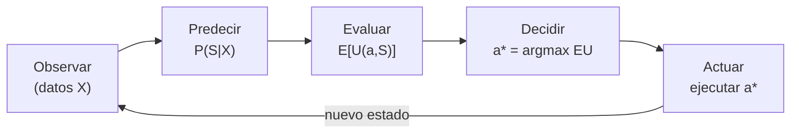
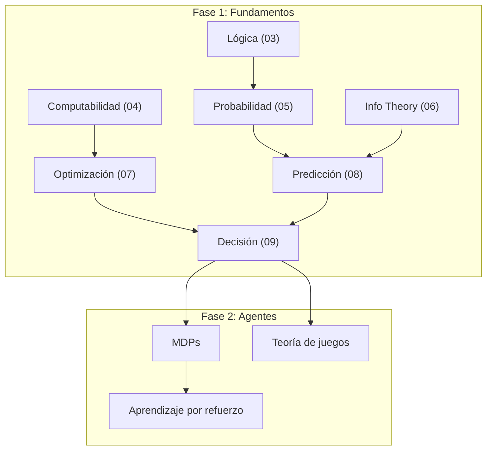

# El Agente que Decide: Conectando Todo

> *"Intelligence is the ability to adapt to change."*
> — Stephen Hawking

---

## La fórmula completa

A lo largo de los últimos módulos hemos construido cada pieza por separado. Ahora ensamblamos el pipeline completo de un agente racional:

Cada etapa corresponde a un módulo del curso:

| Etapa | ¿Qué hace? | Módulo |
|-------|-----------|--------|
| **Observar** | Recolecta datos del entorno | Probabilidad (mod 05) |
| **Predecir** | Estima $P(S \mid X)$ o $E[Y \mid X]$ | Predicción (mod 08) |
| **Evaluar** | Calcula $E[U(a, S)]$ para cada acción | Decisión (mod 09) |
| **Decidir** | Encuentra $a^{∗} = \arg\max_a E[U(a)]$ | Optimización (mod 07) |
| **Actuar** | Ejecuta la acción en el mundo | Agentes (mod 02) |

La **teoría de la decisión** es el pegamento que une predicción con acción. Sin ella, la predicción es contemplación; sin predicción, la decisión es un salto al vacío.

---

## Taxonomía de problemas de decisión

No todos los problemas de decisión son iguales. Podemos clasificarlos en dos dimensiones:

| | **Estados conocidos** | **Estados inciertos** |
|---|---|---|
| **Una decisión** | Optimización (mod 07) | Teoría de decisión (mod 09) |
| **Decisiones secuenciales** | Programación dinámica | MDPs / RL |
| **Múltiples agentes** | Teoría de juegos (determinista) | Juegos estocásticos |

Lo que hemos cubierto hasta ahora está en la esquina superior. Los módulos futuros se moverán hacia abajo:

- **Decisiones secuenciales:** ¿Qué pasa cuando mi acción de hoy afecta mis opciones de mañana? → Procesos de Decisión de Markov (MDPs)
- **Aprendizaje por refuerzo:** ¿Qué pasa cuando ni siquiera conozco $U$ o $P(S)$, y debo aprenderlos por experiencia?
- **Múltiples agentes:** ¿Qué pasa cuando otros agentes también están optimizando y sus acciones me afectan? → Teoría de juegos

---

## La predicción al servicio de la decisión

Un punto sutil pero crucial: **una predicción solo tiene valor si cambia la decisión**.

:::example{title="El modelo inútil con 95% de accuracy"}
Un hospital decide tratar a todos los pacientes de urgencias, sin importar el diagnóstico (porque el costo de no tratar es catastrófico). Un equipo de ML construye un modelo predictivo con 95% de accuracy para el diagnóstico.

**¿Cuál es el VoI de este modelo?**

$\text{VoI} = EU(\text{con modelo}) - EU(\text{sin modelo}) = EU(\text{tratar siempre}) - EU(\text{tratar siempre}) = 0$

El modelo no vale nada — no porque sea malo, sino porque no cambia la decisión. El hospital trata a todos de todos modos.
:::

Esto lleva a una regla práctica:

> **Antes de construir un modelo predictivo, pregunta: ¿existe una decisión que este modelo podría cambiar?**

Si la respuesta es no, el modelo es investigación pura (que tiene su valor), pero no es útil *operativamente*.

### Cuándo la predicción tiene valor

| La predicción tiene valor cuando... | Ejemplo |
|--------------------------------------|---------|
| Diferentes predicciones → diferentes acciones | Pronóstico de lluvia → llevar/no llevar paraguas |
| La acción óptima depende del estado predicho | Inventario: cantidad a ordenar depende de demanda predicha |
| El costo de la información < VoI | Test médico: si el test es barato y cambia el tratamiento |

| La predicción NO tiene valor cuando... | Ejemplo |
|----------------------------------------|---------|
| La acción óptima es la misma para todos los estados | Tratar siempre en urgencias |
| El costo de la predicción > VoI | Modelo caro que apenas mejora la decisión |
| La decisión no admite cambios | Acción ya ejecutada, irreversible |

---

## Mirando adelante

Este módulo cierra la Fase 1 del curso (Fundamentos). Hemos construido el vocabulario completo de un agente racional:

Lo que viene:

| Módulo futuro | Pregunta | Extiende... |
|--------------|----------|-------------|
| **Causalidad** | ¿Qué pasa si *intervengo*? (no solo observo) | Predicción + Decisión |
| **MDPs** | ¿Cómo decidir cuando las decisiones son secuenciales? | Decisión + Optimización |
| **Teoría de juegos** | ¿Cómo decidir cuando hay otros agentes? | Decisión |
| **Aprendizaje por refuerzo** | ¿Cómo aprender a decidir por experiencia? | MDPs + Predicción |

---

## Reflexión final

El módulo 08 terminó con:

> *"The oracle sees, but cannot choose."*

El oráculo puede predecir el futuro, pero no puede decidir qué hacer con esa visión. La predicción es contemplación — poderosa, necesaria, pero insuficiente.

Este módulo ha cruzado esa frontera. Con los axiomas de utilidad, el principio MEU, los árboles de decisión y el valor de la información, hemos dotado al agente no solo de la capacidad de **ver** sino de **elegir**.

La fórmula es engañosamente simple:

$$a^{∗} = \arg\max_{a \in A} \; E_{S}[U(a, S)]$$

Pero contiene todo: creencias ($P(S)$), preferencias ($U$), y racionalidad ($\arg\max$). Es el puente entre la estadística y la acción, entre el conocimiento y la agencia.

En los módulos que siguen, este agente se volverá más sofisticado — tomará decisiones a lo largo del tiempo, enfrentará a otros agentes, aprenderá de sus errores. Pero el principio será siempre el mismo: **maximizar la utilidad esperada**, con toda la información disponible, de la forma más inteligente posible.

Del oráculo que ve pero no elige, al agente que ve *y* elige.

---

**Anterior:** [Optimización estocástica](04_optimizacion_estocastica.md) | **Inicio:** [Índice del módulo](00_index.md)
