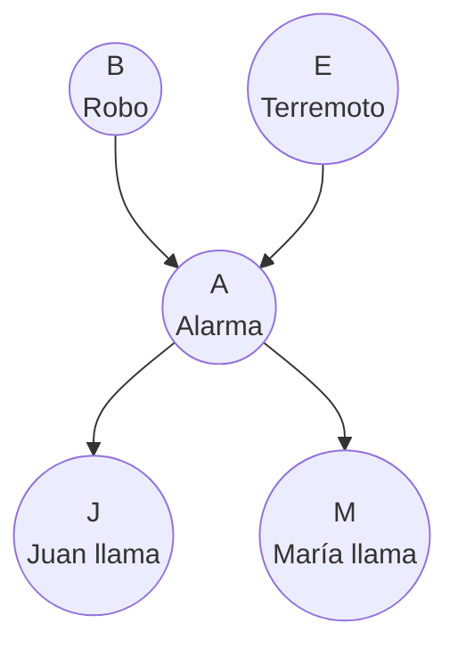
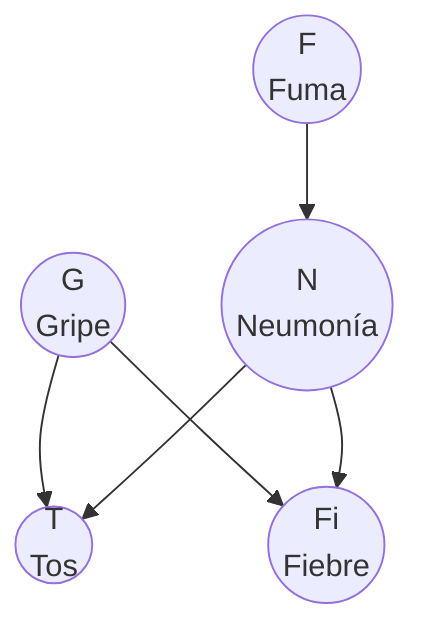
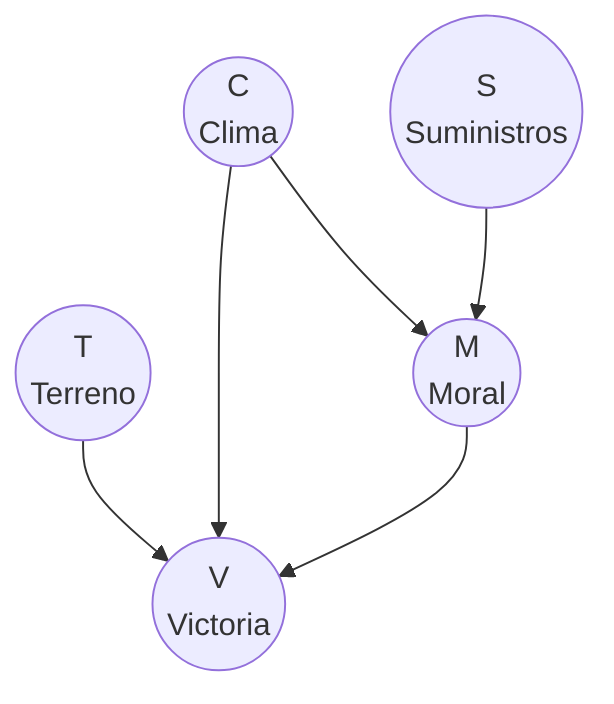
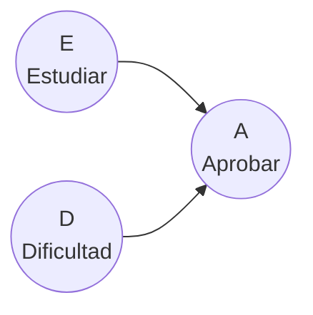

# Queries y Tablas de Probabilidad Condicional

> *"The question is not what you look at, but what you see."*
> — Henry David Thoreau

---

## Tablas de Probabilidad Condicional (CPTs)

En la sección anterior vimos que una red Bayesiana necesita dos cosas: un **grafo** (estructura) y las **tablas de probabilidad condicional** (parámetros). Ahora vamos a profundizar en las tablas.

### ¿Qué es una CPT?

Una **CPT** (Conditional Probability Table) especifica $P(X_i \mid \text{Padres}(X_i))$ para todas las combinaciones posibles de valores.

Volvamos al ejemplo de Lluvia → Mojado → Resbalón.

**CPT de Lluvia ($L$):** No tiene padres, así que es simplemente una distribución marginal.

| $L$ | $P(L)$ |
|:---:|:------:|
| sí | 0.3 |
| no | 0.7 |

**CPT de Mojado ($M$):** Su padre es $L$, así que especificamos $P(M \mid L)$ para cada valor de $L$.

| $L$ | $M$ | $P(M \mid L)$ |
|:---:|:---:|:-------------:|
| sí | sí | 0.9 |
| sí | no | 0.1 |
| no | sí | 0.2 |
| no | no | 0.8 |

**Lectura:** Si llueve, hay 90% de probabilidad de que el piso esté mojado. Si no llueve, solo 20% (quizá por la regadera del vecino).

**CPT de Resbalón ($R$):** Su padre es $M$.

| $M$ | $R$ | $P(R \mid M)$ |
|:---:|:---:|:-------------:|
| sí | sí | 0.7 |
| sí | no | 0.3 |
| no | sí | 0.1 |
| no | no | 0.9 |

**Lectura:** Si el piso está mojado, hay 70% de probabilidad de resbalarse. Si está seco, solo 10%.

### Propiedades de las CPTs

Cada CPT cumple dos propiedades:

1. **Cada entrada está entre 0 y 1:** $0 \leq P(X_i \mid \text{Padres}) \leq 1$

2. **Las columnas suman 1:** Para cada combinación de padres fija, las probabilidades del nodo suman 1.

Por ejemplo, en la CPT de $M$: cuando $L = \text{sí}$, $P(M=\text{sí} \mid L=\text{sí}) + P(M=\text{no} \mid L=\text{sí}) = 0.9 + 0.1 = 1$.

### ¿Cuántos números necesita una CPT?

Si $X_i$ tiene $k$ valores posibles y sus padres tienen en total $j$ combinaciones posibles, la CPT de $X_i$ necesita:

$$j \times (k - 1) \text{ parámetros libres}$$

El "$k-1$" es porque la última probabilidad se puede calcular restando de 1 (ya que la columna suma 1). En la práctica, almacenamos los $j \times k$ números por claridad.

:::example{title="Tamaño de CPT para la Alarma de Holmes"}

En la red de Sherlock Holmes, la CPT de la Alarma ($A$) tiene dos padres binarios: Robo ($B$) y Terremoto ($E$).

- Combinaciones de padres: $2 \times 2 = 4$ (sí-sí, sí-no, no-sí, no-no)
- Valores de $A$: 2 (sí, no)
- Parámetros libres: $4 \times (2-1) = 4$

| $B$ | $E$ | $P(A=\text{sí} \mid B, E)$ | $P(A=\text{no} \mid B, E)$ |
|:---:|:---:|:---------------------------:|:---------------------------:|
| sí | sí | 0.95 | 0.05 |
| sí | no | 0.94 | 0.06 |
| no | sí | 0.29 | 0.71 |
| no | no | 0.001 | 0.999 |

**Lectura fila por fila:**
- Si hay robo Y terremoto → alarma suena casi seguro (0.95)
- Si hay robo pero NO terremoto → alarma suena casi seguro (0.94)
- Si NO hay robo pero SÍ terremoto → alarma suena a veces (0.29)
- Si NO hay robo ni terremoto → alarma casi nunca suena (0.001)
:::

---

## Especificación completa de una red Bayesiana

Para definir completamente una red Bayesiana necesitas:

**1. Lista de variables** y sus valores posibles.

**2. Estructura del grafo** (quién es padre de quién).

**3. Una CPT por cada variable.**

:::example{title="Red completa: Alarma de Sherlock Holmes"}

**Variables:** $B$, $E$, $A$, $J$, $M$ (todas binarias: sí/no)

**Estructura:**

**CPTs:**

$P(B)$:

| $B$ | $P(B)$ |
|:---:|:------:|
| sí | 0.001 |
| no | 0.999 |

$P(E)$:

| $E$ | $P(E)$ |
|:---:|:------:|
| sí | 0.002 |
| no | 0.998 |

$P(A \mid B, E)$:

| $B$ | $E$ | $P(A=\text{sí})$ |
|:---:|:---:|:-----------------:|
| sí | sí | 0.95 |
| sí | no | 0.94 |
| no | sí | 0.29 |
| no | no | 0.001 |

$P(J \mid A)$:

| $A$ | $P(J=\text{sí})$ |
|:---:|:-----------------:|
| sí | 0.90 |
| no | 0.05 |

$P(M \mid A)$:

| $A$ | $P(M=\text{sí})$ |
|:---:|:-----------------:|
| sí | 0.70 |
| no | 0.01 |

Con estas tablas y la estructura, podemos calcular la probabilidad de **cualquier** combinación de valores. Por ejemplo:

$$P(B=\text{no}, E=\text{no}, A=\text{sí}, J=\text{sí}, M=\text{no})$$

$$= P(B=\text{no}) \cdot P(E=\text{no}) \cdot P(A=\text{sí} \mid B=\text{no}, E=\text{no}) \cdot P(J=\text{sí} \mid A=\text{sí}) \cdot P(M=\text{no} \mid A=\text{sí})$$

$$= 0.999 \times 0.998 \times 0.001 \times 0.90 \times 0.30$$

$$= 0.000269$$
:::

---

## Tipos de variables en una consulta

Cuando queremos hacer una **pregunta** (query) a la red, las variables se clasifican en tres tipos:

### 1. Variables de consulta (query variables) — $Q$

Son las variables cuya probabilidad queremos calcular. Es lo que **preguntamos**.

**Ejemplo:** "¿Cuál es la probabilidad de que haya un robo?" → $Q = \{B\}$

### 2. Variables de evidencia (evidence variables) — $E$

Son las variables cuyo valor **observamos**. Es lo que **sabemos**.

**Ejemplo:** "Sabemos que Juan llamó y María no llamó" → $E = \{J = \text{sí}, M = \text{no}\}$

### 3. Variables ocultas (hidden variables) — $H$

Son las variables que **ni preguntamos ni observamos**. Están en la red pero no aparecen en la consulta. Necesitamos **marginalizar** sobre ellas (sumar sobre todos sus valores posibles).

**Ejemplo:** Si preguntamos $P(B \mid J=\text{sí}, M=\text{no})$, entonces $E$ y $A$ son variables ocultas.

### Visualización

| Variable | Tipo | ¿Qué hacemos con ella? |
|----------|------|------------------------|
| $B$ (Robo) | **Consulta** | Calcular su probabilidad |
| $J$ (Juan), $M$ (María) | **Evidencia** | Fijar sus valores observados |
| $E$ (Terremoto), $A$ (Alarma) | **Oculta** | Marginalizar (sumar sobre sus valores) |

:::exercise{title="Identifica los tipos de variables"}
En la red de Sherlock Holmes, clasifica las variables para cada consulta:

1. $P(E \mid A = \text{sí})$
2. $P(B \mid J = \text{sí}, M = \text{sí})$
3. $P(A \mid B = \text{sí}, E = \text{no})$
:::

<strong>Ver Respuestas</strong>

1. $P(E \mid A = \text{sí})$:
   - Consulta: $E$
   - Evidencia: $A = \text{sí}$
   - Ocultas: $B$, $J$, $M$

2. $P(B \mid J = \text{sí}, M = \text{sí})$:
   - Consulta: $B$
   - Evidencia: $J = \text{sí}$, $M = \text{sí}$
   - Ocultas: $E$, $A$

3. $P(A \mid B = \text{sí}, E = \text{no})$:
   - Consulta: $A$
   - Evidencia: $B = \text{sí}$, $E = \text{no}$
   - Ocultas: $J$, $M$

---

## ¿Qué es un query?

Un **query** (consulta probabilística) es una pregunta de la forma:

$$P(Q \mid E = e)$$

Donde:
- $Q$ son las variables de consulta
- $E = e$ es la evidencia observada

Para calcular esta probabilidad, usamos la definición de probabilidad condicional:

$$P(Q \mid E = e) = \frac{P(Q, E = e)}{P(E = e)}$$

Y tanto el numerador como el denominador requieren **marginalizar** sobre las variables ocultas $H$:

$$P(Q, E = e) = \sum_{h} P(Q, E = e, H = h)$$

$$P(E = e) = \sum_{q} \sum_{h} P(Q = q, E = e, H = h)$$

La buena noticia es que $P(E = e)$ es simplemente una constante de normalización: hace que las probabilidades sumen 1. A menudo escribimos:

$$P(Q \mid E = e) = \alpha \cdot P(Q, E = e)$$

donde $\alpha = \frac{1}{P(E = e)}$ es la constante de normalización.

---

## Variables latentes

Las **variables latentes** son un caso especial de variables ocultas. Son variables que:

1. **Nunca** se observan directamente (no porque no las hayamos observado en este query, sino porque son intrínsecamente no observables)
2. Representan conceptos abstractos o estados internos

| Tipo | Descripción | Ejemplo |
|------|-------------|---------|
| **Oculta** | No observada en *este* query, pero podría serlo | Terremoto en Holmes (podríamos saber si hubo terremoto, pero no lo checamos) |
| **Latente** | Nunca observable directamente | "Inteligencia" de un estudiante, "calidad" de un producto |

En la práctica computacional, el tratamiento es el mismo: marginalizamos sobre ambas. La distinción es más conceptual que algorítmica.

---

## Red médica completa con CPTs

Retomemos la red de diagnóstico médico con todas sus tablas.

**CPTs completas:**

$P(F)$:

| $F$ | $P(F)$ |
|:---:|:------:|
| sí | 0.20 |
| no | 0.80 |

$P(G)$:

| $G$ | $P(G)$ |
|:---:|:------:|
| sí | 0.10 |
| no | 0.90 |

$P(N \mid F)$:

| $F$ | $P(N=\text{sí} \mid F)$ |
|:---:|:------------------------:|
| sí | 0.15 |
| no | 0.02 |

$P(T \mid G, N)$:

| $G$ | $N$ | $P(T=\text{sí} \mid G, N)$ |
|:---:|:---:|:---------------------------:|
| sí | sí | 0.95 |
| sí | no | 0.80 |
| no | sí | 0.60 |
| no | no | 0.05 |

$P(Fi \mid G, N)$:

| $G$ | $N$ | $P(Fi=\text{sí} \mid G, N)$ |
|:---:|:---:|:----------------------------:|
| sí | sí | 0.95 |
| sí | no | 0.85 |
| no | sí | 0.70 |
| no | no | 0.01 |

Con esta red completa, podemos responder preguntas como:
- "¿Cuál es la probabilidad de neumonía dado que el paciente tose y tiene fiebre?"
  → $P(N = \text{sí} \mid T = \text{sí}, Fi = \text{sí})$
- "¿Cuál es la probabilidad de gripe dado que el paciente fuma y tose?"
  → $P(G = \text{sí} \mid F = \text{sí}, T = \text{sí})$

En la siguiente sección aprenderemos **cómo** calcular estas probabilidades.

---

## Red de Campaña de Napoleón con CPTs

Completemos la red de Napoleón con sus tablas numéricas.

**CPTs:**

$P(T)$: (Terreno favorable)

| $T$ | $P(T)$ |
|:---:|:------:|
| sí | 0.40 |
| no | 0.60 |

$P(C)$: (Clima favorable)

| $C$ | $P(C)$ |
|:---:|:------:|
| sí | 0.50 |
| no | 0.50 |

$P(S)$: (Suministros suficientes)

| $S$ | $P(S)$ |
|:---:|:------:|
| sí | 0.70 |
| no | 0.30 |

$P(M \mid C, S)$: (Moral alta)

| $C$ | $S$ | $P(M=\text{sí} \mid C, S)$ |
|:---:|:---:|:---------------------------:|
| sí | sí | 0.90 |
| sí | no | 0.50 |
| no | sí | 0.60 |
| no | no | 0.10 |

$P(V \mid T, C, M)$: (Victoria)

| $T$ | $C$ | $M$ | $P(V=\text{sí} \mid T, C, M)$ |
|:---:|:---:|:---:|:------------------------------:|
| sí | sí | sí | 0.95 |
| sí | sí | no | 0.60 |
| sí | no | sí | 0.70 |
| sí | no | no | 0.30 |
| no | sí | sí | 0.80 |
| no | sí | no | 0.40 |
| no | no | sí | 0.50 |
| no | no | no | 0.10 |

**Query de ejemplo:** "Si el terreno es favorable y los suministros son buenos, ¿cuál es la probabilidad de victoria?"

$$P(V = \text{sí} \mid T = \text{sí}, S = \text{sí})$$

Aquí $C$ y $M$ son variables ocultas. Necesitamos marginalizar sobre ellas. Aprenderemos cómo en la siguiente sección.

---

:::exercise{title="Construye tu propia CPT"}
Considera una red simple con tres variables binarias:

1. ¿Cuántas CPTs necesitas? ¿Cuántos parámetros libres en total?
2. Inventa valores razonables para las tres CPTs.
3. Usando tus CPTs, calcula $P(E=\text{sí}, D=\text{alta}, A=\text{sí})$.
4. ¿Qué tipo de variable es $D$ en el query $P(A \mid E=\text{sí})$?
:::

<strong>Ver Respuestas</strong>

1. **Tres CPTs:** $P(E)$, $P(D)$, $P(A \mid E, D)$.
   Parámetros libres: $1 + 1 + 4 \times 1 = 6$ (cada variable binaria tiene 1 parámetro libre por combinación de padres).

2. Ejemplo de CPTs razonables:

   $P(E)$: sí = 0.6, no = 0.4

   $P(D)$: alta = 0.3, baja = 0.7

   $P(A=\text{sí} \mid E, D)$:
   - E=sí, D=alta → 0.60
   - E=sí, D=baja → 0.95
   - E=no, D=alta → 0.10
   - E=no, D=baja → 0.40

3. $P(E=\text{sí}, D=\text{alta}, A=\text{sí}) = P(E=\text{sí}) \cdot P(D=\text{alta}) \cdot P(A=\text{sí} \mid E=\text{sí}, D=\text{alta})$
   $= 0.6 \times 0.3 \times 0.60 = 0.108$

4. $D$ es una **variable oculta** en $P(A \mid E=\text{sí})$ — no se pregunta ni se observa, hay que marginalizar sobre ella.

---

**Anterior:** [De Probabilidades a Grafos](01_probabilidad_y_grafos.md) | **Siguiente:** [Inferencia por Enumeración →](03_inferencia_fuerza_bruta.md)
