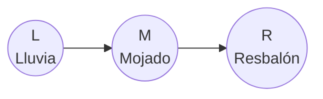

# Inferencia por Enumeración (Fuerza Bruta)

> *"Brute force is the last refuge of the incompetent — but it's the first thing you should understand."*
> — adaptado de Isaac Asimov

---

## El problema de inferencia

Ya tenemos una red Bayesiana completa (estructura + CPTs). Ahora queremos **responder preguntas**. El problema de inferencia es:

> Dada una red Bayesiana y evidencia observada $E = e$, calcular $P(Q \mid E = e)$ para una variable de consulta $Q$.

Vamos paso a paso.

---

## Derivación matemática

### Paso 1: Aplicar la definición de condicional

$$P(Q \mid E = e) = \frac{P(Q, E = e)}{P(E = e)}$$

### Paso 2: Marginalizar las variables ocultas

Las variables ocultas $H = \{H_1, H_2, \ldots, H_k\}$ no aparecen en la consulta, pero están en la red. Necesitamos sumar sobre todos sus valores:

$$P(Q, E = e) = \sum_{h_1} \sum_{h_2} \cdots \sum_{h_k} P(Q, E = e, H_1 = h_1, \ldots, H_k = h_k)$$

### Paso 3: Usar la factorización de la red

La conjunta se descompone según la estructura de la red:

$$P(X_1, \ldots, X_n) = \prod_{i=1}^{n} P(X_i \mid \text{Padres}(X_i))$$

Entonces:

$$P(Q, E = e) = \sum_{h_1} \cdots \sum_{h_k} \prod_{i=1}^{n} P(X_i \mid \text{Padres}(X_i))$$

donde cada $X_i$ toma su valor según si es variable de consulta (libre), evidencia (fijada en $e$) u oculta (siendo sumada).

### Paso 4: Normalizar

$$P(E = e) = \sum_{q} P(Q = q, E = e)$$

Finalmente:

$$P(Q \mid E = e) = \frac{P(Q, E = e)}{\sum_{q} P(Q = q, E = e)}$$

O equivalentemente, usando la constante de normalización $\alpha$:

$$P(Q \mid E = e) = \alpha \cdot P(Q, E = e)$$

donde

$$\alpha \;=\; \frac{1}{P(E=e)} \;=\; \frac{1}{\sum_{q} P(Q=q, E=e)}$$

y sirve para **normalizar**.

**¿Qué significa normalizar?**  
Después de los pasos 2–3 solemos poder calcular \(P(Q=q, E=e)\) para cada valor posible \(q\) de \(Q\). Esos números son “scores” correctos **en proporción**, pero todavía no forman una distribución sobre \(Q\) porque no necesariamente suman 1.  
**Normalizar** significa convertirlos en probabilidades válidas dividiendo entre la suma total (de modo que ahora sí sumen 1).

**Ejemplo numérico (sencillo):** supón que \(Q\) es binaria (\(q\in\{\text{sí},\text{no}\}\)) y que calculaste:

$$P(Q=\text{sí},E=e)=0.02,\qquad P(Q=\text{no},E=e)=0.08.$$

Entonces la evidencia es:

$$P(E=e)=0.02+0.08=0.10,$$

la constante es \(\alpha = 1/0.10 = 10\), y el posterior queda:

$$P(Q=\text{sí}\mid E=e)=10\cdot 0.02=0.2,\qquad P(Q=\text{no}\mid E=e)=10\cdot 0.08=0.8.$$

Ahora sí: \(0.2+0.8=1\).

---

## Ejemplo paso a paso: Lluvia → Mojado → Resbalón

Usemos la red de lluvia con las CPTs definidas en la sección anterior.



**CPTs (recordatorio):**
- $P(L=\text{sí}) = 0.3$, $P(L=\text{no}) = 0.7$
- $P(M=\text{sí} \mid L=\text{sí}) = 0.9$, $P(M=\text{sí} \mid L=\text{no}) = 0.2$
- $P(R=\text{sí} \mid M=\text{sí}) = 0.7$, $P(R=\text{sí} \mid M=\text{no}) = 0.1$

### Query: $P(L \mid R = \text{sí})$

"Si me resbalé, ¿cuál es la probabilidad de que haya llovido?"

#### Capa 1: Lenguaje natural

Queremos actualizar nuestra creencia sobre la lluvia usando la evidencia de que hubo resbalón:

1. Fijamos la evidencia observada (\(R=\text{sí}\)).
2. Probamos cada hipótesis de la consulta (\(L=\text{sí}\) y \(L=\text{no}\)).
3. Para cada hipótesis, sumamos todos los casos posibles de la variable oculta (\(M\)).
4. Con esos dos valores no normalizados, normalizamos para obtener una distribución válida.

**Clasificación de variables:**
- Consulta: $L$
- Evidencia: $R = \text{sí}$
- Oculta: $M$

#### Capa 2: Matemática del ejemplo

**Paso 1 — Fórmula del query:**

$$P(L \mid R=\text{sí}) = \alpha \cdot P(L, R=\text{sí}) = \alpha \sum_{m} P(L, M=m, R=\text{sí})$$

**Paso 2 — Expandir usando la factorización de la red:**

$$P(L, M, R) = P(L) \cdot P(M \mid L) \cdot P(R \mid M)$$

Entonces:

$$P(L, R=\text{sí}) = \sum_{m} P(L) \cdot P(M=m \mid L) \cdot P(R=\text{sí} \mid M=m)$$

#### Capa 3: Traza numérica del ejemplo

**Paso 3 — Calcular para \(L = \text{sí}\):**

$$P(L=\text{sí}, R=\text{sí}) = \sum_{m} P(L=\text{sí}) \cdot P(M=m \mid L=\text{sí}) \cdot P(R=\text{sí} \mid M=m)$$

Expandimos la suma sobre $M$:

$$= P(L=\text{sí}) \cdot \Big[ P(M=\text{sí} \mid L=\text{sí}) \cdot P(R=\text{sí} \mid M=\text{sí}) + P(M=\text{no} \mid L=\text{sí}) \cdot P(R=\text{sí} \mid M=\text{no}) \Big]$$

$$= 0.3 \times \Big[ 0.9 \times 0.7 + 0.1 \times 0.1 \Big]$$

$$= 0.3 \times \Big[ 0.63 + 0.01 \Big]$$

$$= 0.3 \times 0.64 = 0.192$$

**Paso 4 — Calcular para \(L = \text{no}\):**

$$P(L=\text{no}, R=\text{sí}) = 0.7 \times \Big[ 0.2 \times 0.7 + 0.8 \times 0.1 \Big]$$

$$= 0.7 \times \Big[ 0.14 + 0.08 \Big]$$

$$= 0.7 \times 0.22 = 0.154$$

**Paso 5 — Normalizar:**

$$P(R=\text{sí}) = 0.192 + 0.154 = 0.346$$

$$P(L=\text{sí} \mid R=\text{sí}) = \frac{0.192}{0.346} \approx 0.555$$

$$P(L=\text{no} \mid R=\text{sí}) = \frac{0.154}{0.346} \approx 0.445$$

**Interpretación:** Antes de observar el resbalón, la probabilidad de lluvia era $P(L=\text{sí}) = 0.3$. Después de observar que alguien se resbaló, la probabilidad de lluvia sube a $\approx 0.555$. La evidencia del resbalón **actualiza** nuestra creencia sobre la lluvia — la información fluye "hacia atrás" en el grafo gracias al **teorema de Bayes**.

#### Capa 4: Traza de código (mismo ejemplo)

```text
EnumeraciónInferencia(Q=L, e={R=sí}, red)
│
├── q = sí: e_ext = {R=sí, L=sí}
│   └── EnumerarTodo([L, M, R], {R=sí, L=sí}, red)
│       ├── L=sí (fijo): P(L=sí) = 0.3
│       │   └── × EnumerarTodo([M, R], {R=sí, L=sí}, red)
│       │       ├── M es oculta: sumar
│       │       ├── M=sí: P(M=sí|L=sí)=0.9
│       │       │   └── × P(R=sí|M=sí)=0.7  → 0.63
│       │       ├── M=no: P(M=no|L=sí)=0.1
│       │       │   └── × P(R=sí|M=no)=0.1  → 0.01
│       │       └── suma = 0.64
│       └── resultado no normalizado(q=sí) = 0.3 × 0.64 = 0.192
│
├── q = no: (análogo) → 0.154
│
└── Normalizar:
    α = 1 / (0.192 + 0.154) = 1/0.346
    posterior = {sí: 0.555, no: 0.445}
```

---

## El grafo computacional

Es útil visualizar el cálculo como un **grafo computacional** — un árbol que muestra todas las combinaciones que debemos evaluar.

Para el query $P(L \mid R = \text{sí})$, el grafo de enumeración se ve así:

```
                          P(L, R=sí)
                         /          \
                   L=sí              L=no
                  P(L=sí)=0.3       P(L=no)=0.7
                  /       \          /       \
            M=sí          M=no    M=sí       M=no
           P(M=s|L=s)   P(M=n|L=s)  ...       ...
            = 0.9         = 0.1
            |             |
          R=sí          R=sí
         P(R=s|M=s)    P(R=s|M=n)
          = 0.7          = 0.1
```

Cada **hoja** del árbol corresponde a una asignación completa de todas las variables. El valor de cada hoja es el producto de todas las probabilidades a lo largo del camino desde la raíz.

| Camino | $L$ | $M$ | $R$ | Producto |
|--------|:---:|:---:|:---:|:--------:|
| 1 | sí | sí | sí | $0.3 \times 0.9 \times 0.7 = 0.189$ |
| 2 | sí | no | sí | $0.3 \times 0.1 \times 0.1 = 0.003$ |
| 3 | no | sí | sí | $0.7 \times 0.2 \times 0.7 = 0.098$ |
| 4 | no | no | sí | $0.7 \times 0.8 \times 0.1 = 0.056$ |

Para obtener $P(L = \text{sí}, R = \text{sí})$, sumamos las hojas donde $L = \text{sí}$:

$$0.189 + 0.003 = 0.192 \quad \checkmark$$

Para $P(L = \text{no}, R = \text{sí})$:

$$0.098 + 0.056 = 0.154 \quad \checkmark$$

---

## Ejemplo: Query en la red de Sherlock Holmes

Calculemos $P(B = \text{sí} \mid J = \text{sí}, M = \text{sí})$: "Si Juan y María llamaron, ¿cuál es la probabilidad de que hubo un robo?"

**Variables:**
- Consulta: $B$
- Evidencia: $J = \text{sí}$, $M = \text{sí}$
- Ocultas: $E$, $A$

**Fórmula:**

$$P(B, J=\text{sí}, M=\text{sí}) = \sum_{e} \sum_{a} P(B) \cdot P(E=e) \cdot P(A=a \mid B, E=e) \cdot P(J=\text{sí} \mid A=a) \cdot P(M=\text{sí} \mid A=a)$$

Necesitamos evaluar esta suma para $B = \text{sí}$ y $B = \text{no}$, con $E \in \{\text{sí}, \text{no}\}$ y $A \in \{\text{sí}, \text{no}\}$.

**Para $B = \text{sí}$:**

| $E$ | $A$ | $P(B{=}s)$ | $P(E)$ | $P(A \mid B{=}s,E)$ | $P(J{=}s \mid A)$ | $P(M{=}s \mid A)$ | Producto |
|:---:|:---:|:---:|:---:|:---:|:---:|:---:|:---:|
| sí | sí | 0.001 | 0.002 | 0.95 | 0.90 | 0.70 | $1.197 \times 10^{-6}$ |
| sí | no | 0.001 | 0.002 | 0.05 | 0.05 | 0.01 | $5.0 \times 10^{-11}$ |
| no | sí | 0.001 | 0.998 | 0.94 | 0.90 | 0.70 | $5.914 \times 10^{-4}$ |
| no | no | 0.001 | 0.998 | 0.06 | 0.05 | 0.01 | $2.994 \times 10^{-8}$ |

$$P(B=\text{sí}, J=\text{sí}, M=\text{sí}) \approx 5.926 \times 10^{-4}$$

**Para $B = \text{no}$:** (cálculo análogo)

| $E$ | $A$ | $P(B{=}n)$ | $P(E)$ | $P(A \mid B{=}n,E)$ | $P(J{=}s \mid A)$ | $P(M{=}s \mid A)$ | Producto |
|:---:|:---:|:---:|:---:|:---:|:---:|:---:|:---:|
| sí | sí | 0.999 | 0.002 | 0.29 | 0.90 | 0.70 | $3.652 \times 10^{-4}$ |
| sí | no | 0.999 | 0.002 | 0.71 | 0.05 | 0.01 | $7.093 \times 10^{-7}$ |
| no | sí | 0.999 | 0.998 | 0.001 | 0.90 | 0.70 | $6.281 \times 10^{-4}$ |
| no | no | 0.999 | 0.998 | 0.999 | 0.05 | 0.01 | $4.985 \times 10^{-4}$ |

$$P(B=\text{no}, J=\text{sí}, M=\text{sí}) \approx 1.492 \times 10^{-3}$$

**Normalización:**

$$P(B=\text{sí} \mid J=\text{sí}, M=\text{sí}) = \frac{5.926 \times 10^{-4}}{5.926 \times 10^{-4} + 1.492 \times 10^{-3}} \approx \frac{5.926 \times 10^{-4}}{2.084 \times 10^{-3}} \approx 0.284$$

**Interpretación:** La prior de robo es $P(B=\text{sí}) = 0.001$ (muy baja). Pero al observar que **ambos** vecinos llamaron, la probabilidad sube a $\approx 0.284$ — un incremento de casi 300x. La evidencia de dos llamadas independientes es fuerte señal de que algo disparó la alarma.

---

## Algoritmos generales (4 abstracciones)

### Algoritmo 1: `EnumeraciónInferencia` (driver principal)

#### 1) Lenguaje natural

Este algoritmo construye la distribución posterior de la variable de consulta \(Q\):
1. Recorre cada valor posible \(q\) de \(Q\).
2. Fija \(Q=q\) junto con la evidencia observada.
3. Llama al algoritmo recursivo (`EnumerarTodo`) para obtener el valor no normalizado \(P(Q=q, E=e)\).
4. Normaliza todos esos valores para que sumen 1.

#### 2) Matemática

Para cada valor \(q\) de \(Q\):

$$f(q) \;=\; P(Q=q, E=e) \;=\; \sum_{h} P(Q=q, E=e, H=h).$$

Luego:

$$P(Q=q \mid E=e) \;=\; \frac{f(q)}{\sum_{q'} f(q')}.$$

#### 3) Traza (ejemplo corto)

```text
Entrada: Q=L, e={R=sí}
f(L=sí)  = 0.192
f(L=no)  = 0.154
normalizador = 0.192 + 0.154 = 0.346
salida: {L=sí: 0.192/0.346, L=no: 0.154/0.346}
```

#### 4) Pseudocódigo

```text
FUNCIÓN EnumeraciónInferencia(Q, e, red):
    // Asumimos orden topológico en red.variables_topológicas
    f ← diccionario vacío   // f(q) = P(Q=q, E=e) (sin normalizar)

    PARA CADA valor q en Dominio(Q):
        e_ext ← e ∪ {Q = q}
        f[q] ← EnumerarTodo(red.variables_topológicas, e_ext, red)

    normalizador ← suma(f.valores())
    resultado ← diccionario vacío
    PARA CADA q en Dominio(Q):
        resultado[q] ← f[q] / normalizador

    RETORNAR resultado
```

**Homologación de variables (matemática ↔ código):**
- \(Q\) ↔ `Q` (variable de consulta)
- \(q\) ↔ `q` (valor específico de \(Q\))
- \(E=e\) ↔ `e` (asignación de evidencia)
- \(f(q)=P(Q=q,E=e)\) ↔ `f[q]`
- \(\sum_{q'} f(q')\) ↔ `normalizador`

### Algoritmo 2: `EnumerarTodo` (recursión sobre variables)

#### 1) Lenguaje natural

Este algoritmo procesa variables una por una en orden topológico:
1. Si la variable actual ya tiene valor fijado (consulta/evidencia), multiplica su factor y sigue.
2. Si no tiene valor fijado (oculta), prueba cada valor posible, suma los resultados y sigue recursivamente.
3. Cuando no quedan variables, retorna 1 (elemento neutro multiplicativo).

#### 2) Matemática

Sea \(X\) la primera variable pendiente y \(R\) el resto.

- Si \(X\) está fijada en \(e\):
$$\text{EnumerarTodo}(X::R,e) \;=\; P(X=e[X]\mid \text{Pa}(X)=e[\text{Pa}(X)]) \cdot \text{EnumerarTodo}(R,e).$$

- Si \(X\) no está fijada:
$$\text{EnumerarTodo}(X::R,e) \;=\; \sum_{x \in \mathrm{Dom}(X)} P(X=x\mid \text{Pa}(X)=e_x[\text{Pa}(X)]) \cdot \text{EnumerarTodo}(R,e_x),$$
donde \(e_x = e \cup \{X=x\}\).

#### 3) Traza (ejemplo corto)

```text
EnumerarTodo([L,M,R], {L=sí, R=sí})
= P(L=sí) * EnumerarTodo([M,R], {L=sí, R=sí})
= 0.3 * [ P(M=sí|L=sí)*P(R=sí|M=sí) + P(M=no|L=sí)*P(R=sí|M=no) ]
= 0.3 * (0.9*0.7 + 0.1*0.1)
= 0.192
```

#### 4) Pseudocódigo

```text
FUNCIÓN EnumerarTodo(vars, e, red):
    SI vars está vacío:
        RETORNAR 1.0

    X ← primer elemento de vars
    resto ← vars sin el primero

    SI X ∈ e:
        p ← ProbabilidadCPT(X, e[X], ValoresPadres(X, e), red)
        RETORNAR p × EnumerarTodo(resto, e, red)

    suma ← 0
    PARA CADA valor x en Dominio(X):
        e_ext ← e ∪ {X = x}
        p ← ProbabilidadCPT(X, x, ValoresPadres(X, e_ext), red)
        suma ← suma + p × EnumerarTodo(resto, e_ext, red)
    RETORNAR suma
```

**Homologación de variables (matemática ↔ código):**
- \(X\) ↔ `X` (variable actual)
- \(R\) ↔ `resto` (variables pendientes)
- \(e\) ↔ `e` (asignación parcial actual)
- \(e_x = e \cup \{X=x\}\) ↔ `e_ext`
- \(\sum_{x \in Dom(X)}\) ↔ `PARA CADA valor x en Dominio(X)`

---

## Cómo leer este pseudocódigo sin perderte

### Checklist mental (5 pasos)

1. **Fija evidencia**: parte de \(e\).
2. **Itera consulta**: para cada \(q\in Dom(Q)\), agrega \(Q=q\).
3. **Enumera ocultas**: la recursión hace las sumas sobre variables no fijadas.
4. **Acumula productos**: cada rama multiplica factores locales \(P(X\mid Pa(X))\).
5. **Normaliza**: divide por la suma total para obtener una distribución válida.

### Invariante clave de la recursión

En cualquier llamada, `EnumerarTodo(vars, e, red)` devuelve:

$$
\sum_{\text{completamientos de } vars \text{ consistentes con } e}
\prod_i P(X_i \mid Pa(X_i)).
$$

Este invariante explica por qué el caso base retorna 1: ya no quedan factores pendientes por multiplicar.

### Mini-tabla de traza (query $P(L \mid R=\text{sí})$)

| Llamada | Variable actual | Acción | Valor parcial |
|---|---|---|---|
| `EnumerarTodo([L,M,R], {L=sí,R=sí})` | \(L\) (fijada) | Multiplicar \(P(L=\text{sí})=0.3\) | \(0.3 \times \text{(resto)}\) |
| `EnumerarTodo([M,R], {L=sí,R=sí})` | \(M\) (oculta) | Sumar \(M=\text{sí},\text{no}\) | \(0.9\cdot0.7 + 0.1\cdot0.1 = 0.64\) |
| retorno | — | Producto final rama \(L=\text{sí}\) | \(0.3 \cdot 0.64 = 0.192\) |

### Errores comunes (y cómo evitarlos)

- **Olvidar normalizar**: `f[q]` no es posterior todavía; falta dividir por `normalizador`.
- **No usar orden topológico**: puede dejar padres sin valor al evaluar una CPT.
- **Confundir evidencia con ocultas**: si \(X\in e\), no se suma sobre \(X\); se fija.
- **Usar la CPT con evidencia incompleta**: `ProbabilidadCPT` siempre requiere valores de padres.

---

## Complejidad computacional

### ¿Cuántas operaciones hace la enumeración?

El algoritmo explora **todas** las combinaciones posibles de las variables ocultas. Si tenemos $k$ variables ocultas, cada una con $d$ valores posibles, el número de combinaciones es:

$$d^k$$

Para cada combinación, evaluamos el producto de todos los factores de la red ($n$ factores). Entonces:

$$\text{Complejidad} = O(n \cdot d^k)$$

### ¿Qué tan malo es esto?

| Variables ocultas ($k$) | Valores ($d = 2$) | Combinaciones |
|:-----------------------:|:------------------:|:-------------:|
| 5 | 2 | 32 |
| 10 | 2 | 1,024 |
| 20 | 2 | 1,048,576 |
| 30 | 2 | 1,073,741,824 |
| 50 | 2 | $\approx 10^{15}$ |

Con 50 variables ocultas binarias, necesitaríamos evaluar más de **un cuadrillón** de combinaciones. Incluso a un millón de evaluaciones por segundo, tomaría más de **30 años**.

### El problema fundamental

La enumeración es **exponencial** en el número de variables ocultas. Para redes pequeñas (5-10 variables) funciona bien. Para redes reales (cientos o miles de variables), es completamente inviable.

**La pregunta:** ¿Podemos hacerlo mejor?

La respuesta es **sí** — usando las independencias que el grafo nos revela. Eso es lo que veremos en las siguientes dos secciones.

---

:::exercise{title="Calcula por enumeración"}

Usa la red Lluvia → Mojado → Resbalón con las CPTs dadas.

1. Calcula $P(M = \text{sí})$ (la probabilidad marginal de que el piso esté mojado).
   *Pista: $L$ es variable oculta.*

2. Calcula $P(L = \text{sí} \mid M = \text{sí})$ (si el piso está mojado, ¿llovió?).
   *Pista: no hay variables ocultas.*

3. ¿Cuántas combinaciones evalúa la enumeración para el query $P(B \mid J=\text{sí}, M=\text{sí})$ en la red de Holmes? ¿Cuántas hojas tiene el árbol de enumeración?
:::

<details>
<summary><strong>Ver Respuestas</strong></summary>

1. **$P(M = \text{sí})$:**

   $$P(M=\text{sí}) = \sum_l P(M=\text{sí}, L=l) = \sum_l P(L=l) \cdot P(M=\text{sí} \mid L=l)$$

   $$= P(L=\text{sí}) \cdot P(M=\text{sí} \mid L=\text{sí}) + P(L=\text{no}) \cdot P(M=\text{sí} \mid L=\text{no})$$

   $$= 0.3 \times 0.9 + 0.7 \times 0.2 = 0.27 + 0.14 = 0.41$$

2. **$P(L = \text{sí} \mid M = \text{sí})$:**

   No hay variables ocultas (solo $L$ y $M$ participan). Usamos Bayes directamente:

   $$P(L=\text{sí} \mid M=\text{sí}) = \frac{P(M=\text{sí} \mid L=\text{sí}) \cdot P(L=\text{sí})}{P(M=\text{sí})} = \frac{0.9 \times 0.3}{0.41} = \frac{0.27}{0.41} \approx 0.659$$

   Si el piso está mojado, hay ~66% de probabilidad de que haya llovido (era 30% antes de observar).

3. **Combinaciones en Holmes:** Variables ocultas son $E$ y $A$ (ambas binarias). Combinaciones: $2^2 = 4$. Para cada valor de $B$ (2 valores), evaluamos 4 combinaciones. Total de hojas: $2 \times 4 = 8$.

</details>

---

**Anterior:** [Queries y Tablas de Probabilidad](02_queries_y_tablas.md) | **Siguiente:** [Independencia y Markov Blanket →](04_independencia_y_markov.md)
