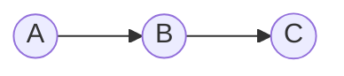
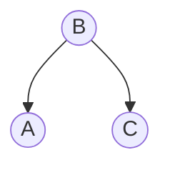
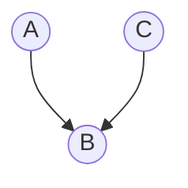
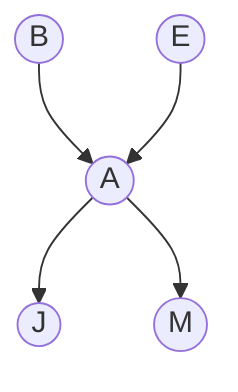
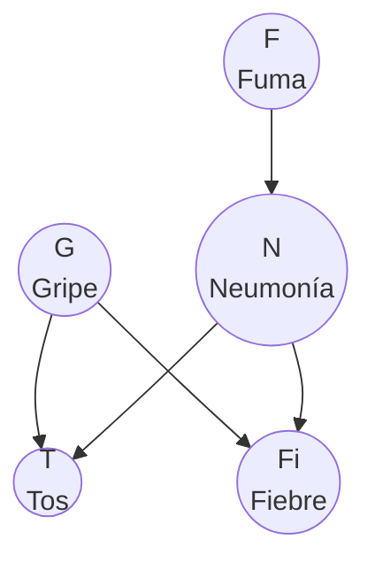
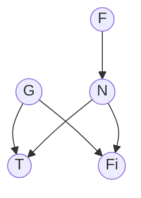
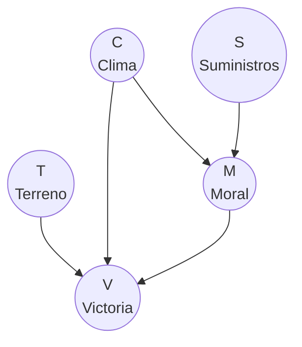

# Independencia Condicional y Markov Blanket

> *"The art of being wise is the art of knowing what to overlook."*
> — William James

---

## ¿Por qué importa la independencia?

En la sección anterior vimos que la inferencia por enumeración es **exponencial** en el número de variables ocultas. La única forma de hacer algo mejor es **evitar sumar sobre combinaciones innecesarias**.

La clave es la **independencia condicional**: cuando dos variables no se afectan mutuamente dado lo que sabemos, podemos tratarlas por separado. Esto reduce drásticamente el número de operaciones.

Las redes Bayesianas nos permiten **leer** estas independencias directamente del grafo, sin hacer ningún cálculo.

---

## Recordatorio: independencia condicional

Dos variables $X$ y $Y$ son **condicionalmente independientes** dado $Z$ si:

$$P(X, Y \mid Z) = P(X \mid Z) \cdot P(Y \mid Z)$$

O equivalentemente:

$$P(X \mid Y, Z) = P(X \mid Z)$$

**En palabras:** una vez que conocemos $Z$, saber $Y$ no nos da información adicional sobre $X$.

**Notación:** $X \perp Y \mid Z$ significa "$X$ es condicionalmente independiente de $Y$ dado $Z$".

**Ojo:** Independencia condicional $\neq$ independencia. Dos variables pueden ser independientes pero no condicionalmente independientes (y viceversa).

---

## Las tres estructuras canónicas

Toda independencia condicional en una red Bayesiana se puede entender a partir de **tres patrones básicos** de tres nodos. Estos son los bloques fundamentales.

### 1. Cadena (Chain)

**Ejemplo:** Lluvia → Mojado → Resbalón

**¿$A$ y $C$ son independientes?** No. La lluvia influye en el resbalón (a través del piso mojado).

**¿$A$ y $C$ son independientes dado $B$?** **Sí.** Si ya sabemos que el piso está mojado, saber si llovió no cambia la probabilidad de resbalarse. El piso mojado "bloquea" la influencia de la lluvia sobre el resbalón.

> **Regla de la cadena:** $A \perp C \mid B$ — la variable intermedia **bloquea** el flujo de información cuando se observa.

**Demostración intuitiva:**

$$P(A, C \mid B) = \frac{P(A, B, C)}{P(B)} = \frac{P(A) \cdot P(B \mid A) \cdot P(C \mid B)}{P(B)}$$

$$= \frac{P(A) \cdot P(B \mid A)}{P(B)} \cdot P(C \mid B) = P(A \mid B) \cdot P(C \mid B)$$

El factor $P(C \mid B)$ no depende de $A$ porque en la red $C$ solo depende de $B$. Al condicionar en $B$, la distribución se factoriza.

### 2. Bifurcación (Fork)

**Ejemplo:** Gripe → Tos y Gripe → Fiebre

**¿$A$ y $C$ son independientes?** No. Si alguien tose, es más probable que tenga gripe, y por lo tanto es más probable que tenga fiebre. Hay correlación entre tos y fiebre.

**¿$A$ y $C$ son independientes dado $B$?** **Sí.** Si ya sabemos que el paciente tiene gripe, saber que tose no cambia la probabilidad de que tenga fiebre. La causa común explica toda la correlación.

> **Regla de la bifurcación:** $A \perp C \mid B$ — la causa común **bloquea** el flujo de información cuando se observa.

**Intuición:** $A$ y $C$ están correlacionados solo porque comparten una causa común $B$. Una vez que fijamos $B$, la correlación desaparece.

### 3. Colisionador (Collider / V-structure)

**Ejemplo:** Robo → Alarma ← Terremoto

**¿$A$ y $C$ son independientes?** **Sí.** Los robos y los terremotos ocurren independientemente.

**¿$A$ y $C$ son independientes dado $B$?** **¡NO!** Si sabemos que la alarma sonó y **no** hubo terremoto, es más probable que haya sido un robo. Observar el efecto común ($B$) **crea** una dependencia entre las causas ($A$ y $C$).

> **Regla del colisionador:** $A \perp C$ (sin condicionar), pero $A \not\perp C \mid B$ — observar el efecto común **abre** el flujo de información.

Este es el caso más contraintuitivo. Se le conoce como **explaining away** (explicar descartando): si una causa explica el efecto observado, la otra causa se vuelve menos probable.

:::example{title="Explaining away: la alarma de Holmes"}
Supón que la alarma de tu vecino sonó ($A = \text{sí}$).

- **Sin más información:** Podría ser un robo O un terremoto. Ambas causas son posibles.

- **Ahora te dicen que hubo un terremoto:** $P(B=\text{sí} \mid A=\text{sí}, E=\text{sí})$ **baja** respecto a $P(B=\text{sí} \mid A=\text{sí})$. El terremoto "explica" la alarma, haciendo menos necesario invocar un robo.

Esto es *explaining away*: una causa explica el efecto, reduciendo la probabilidad de la otra causa.
:::

### Resumen de las tres estructuras

| Estructura | Grafo | ¿Independientes sin condicionar? | ¿Independientes condicionando en el nodo central? |
|-----------|-------|:---:|:---:|
| **Cadena** | $A \to B \to C$ | No | **Sí** ($A \perp C \mid B$) |
| **Bifurcación** | $A \leftarrow B \rightarrow C$ | No | **Sí** ($A \perp C \mid B$) |
| **Colisionador** | $A \rightarrow B \leftarrow C$ | **Sí** ($A \perp C$) | No |

**Patrón clave:** En cadenas y bifurcaciones, observar el nodo central **bloquea** el flujo. En colisionadores, observar el nodo central **abre** el flujo (y no observarlo lo bloquea).

---

## d-Separación

La **d-separación** (directed separation) generaliza las tres estructuras canónicas a **grafos arbitrarios**. Es un criterio *gráfico* (solo depende del grafo, no de los números de las CPTs) para decidir si dos conjuntos de variables deberían ser condicionalmente independientes dado lo que observamos.

### Definición

Sean $X$, $Y$ y $Z$ conjuntos de nodos en una red Bayesiana. Decimos que $X$ y $Y$ están **d-separados** dado $Z$ (escrito $X \perp_d Y \mid Z$) si **no existe ningún camino activo** entre algún nodo en $X$ y algún nodo en $Y$ al condicionar en $Z$.

Aquí, un **camino** es una secuencia de nodos conectados (ignorando la dirección de las flechas). Intuitivamente:
- Un camino **activo** es una ruta por la que “puede fluir información” dado lo observado.
- Un camino **bloqueado** es una ruta que queda “cortada” por la evidencia.

Un camino queda **bloqueado** por $Z$ si existe al menos un nodo intermedio $V$ en el camino que cumpla alguna de estas condiciones:

1. **$V$ NO es colisionador** en ese camino (está en una cadena o bifurcación) **y** \(V \in Z\).  
   (Observar un no-colisionador **bloquea**.)

2. **$V$ SÍ es colisionador** en ese camino **y** ni \(V\) ni ningún descendiente de \(V\) está en \(Z\).  
   (No observar el colisionador —ni nada “debajo” de él— **bloquea**.)

Equivalente (regla en una sola línea): un camino está **activo** dado \(Z\) si **todos** los no-colisionadores del camino están fuera de \(Z\) y **todos** los colisionadores del camino tienen a sí mismos o a un descendiente en \(Z\).

### Regla rápida (tabla)

| Tipo de nodo \(V\) en el camino | ¿Cuándo bloquea \(V\) el camino? | ¿Cuándo deja pasar (no bloquea)? |
|---|---|---|
| **No-colisionador** (cadena o bifurcación) | Si \(V \in Z\) | Si \(V \notin Z\) |
| **Colisionador** (\(\to V \leftarrow\)) | Si \(V \notin Z\) y ningún descendiente de \(V\) está en \(Z\) | Si \(V \in Z\) **o** algún descendiente de \(V\) está en \(Z\) |

### Algoritmo paso a paso

Para determinar si \(X \perp_d Y \mid Z\):

**Paso 1:** Lista todos los caminos entre \(X\) y \(Y\) (tratando las aristas como no dirigidas).

**Paso 2:** Para cada camino, revisa sus nodos intermedios \(V\) (no los extremos) y decide si cada \(V\) es:
- **colisionador** en ese camino (\(\to V \leftarrow\)), o
- **no-colisionador** (cadena o bifurcación).

**Paso 3:** Declara el camino:
- **bloqueado** si encuentras al menos un \(V\) que bloquee (según la tabla de arriba)
- **activo** si *ningún* \(V\) lo bloquea

**Paso 4:** Si **todos** los caminos están bloqueados, entonces \(X \perp_d Y \mid Z\). Si **algún** camino está activo, entonces \(X \not\perp_d Y \mid Z\).

:::example{title="d-Separación en la red de Holmes"}

**Pregunta 1:** ¿$B \perp E$? (sin evidencia)

**Pregunta 1:** ¿\(B \perp_d E\)? (sin evidencia, \(Z=\emptyset\))

Camino: \(B \to A \leftarrow E\). El nodo \(A\) es un **colisionador**. Como \(A \notin Z\) y ningún descendiente de \(A\) está en \(Z\), el camino está **bloqueado**.  
Conclusión: \(B \perp_d E\). (Robo y terremoto son independientes si no observamos nada.)

**Pregunta 2:** ¿$B \perp E \mid A$?

**Pregunta 2:** ¿\(B \perp_d E \mid A\)? (aquí \(Z=\{A\}\))

Mismo camino: \(B \to A \leftarrow E\). \(A\) es colisionador y ahora **sí** está observado (\(A\in Z\)), así que el colisionador se “abre” y el camino queda **activo**.  
Conclusión: \(B \not\perp_d E \mid A\). Si observamos la alarma, robo y terremoto se vuelven dependientes (*explaining away*).

**Pregunta 3:** ¿$J \perp M \mid A$?

**Pregunta 3:** ¿\(J \perp_d M \mid A\)? (aquí \(Z=\{A\}\))

Camino: \(J \leftarrow A \rightarrow M\). El nodo \(A\) es una **bifurcación** (no-colisionador) y está observado (\(A\in Z\)), así que el camino se **bloquea**.  
Conclusión: \(J \perp_d M \mid A\). Si sabemos si sonó la alarma, las llamadas de Juan y María son independientes.

**Pregunta 4:** ¿$B \perp E \mid J$?

**Pregunta 4:** ¿\(B \perp_d E \mid J\)? (aquí \(Z=\{J\}\))

Camino: \(B \to A \leftarrow E\). \(A\) es colisionador. Aunque \(A\notin Z\), sí tenemos un **descendiente observado** (\(J\in Z\) y \(J\) es descendiente de \(A\)). Eso también “abre” el colisionador, así que el camino queda **activo**.  
Conclusión: \(B \not\perp_d E \mid J\). Observar que Juan llamó (un descendiente de la alarma) también crea dependencia entre robo y terremoto.
:::

---

:::exercise{title="Practica d-separación"}

Usa la red de diagnóstico médico:

Determina si son independientes:

1. ¿$F \perp G$?
2. ¿$F \perp G \mid T$?
3. ¿$T \perp Fi \mid G, N$?
4. ¿$F \perp Fi$?
5. ¿$F \perp Fi \mid N$?
:::

<strong>Ver Respuestas</strong>

1. **¿$F \perp G$?** Sí. No hay camino activo entre $F$ y $G$.
   - Camino: $F \to N \to T \leftarrow G$. $T$ es colisionador, no observado → bloqueado.
   - Camino: $F \to N \to Fi \leftarrow G$. $Fi$ es colisionador, no observado → bloqueado.

2. **¿$F \perp G \mid T$?** No.
   - Camino: $F \to N \to T \leftarrow G$. $T$ es colisionador y está observado → **activo**.
   - Si el paciente tose, saber que fuma (más probable neumonía) hace menos probable la gripe y viceversa. Es *explaining away*.

3. **¿$T \perp Fi \mid G, N$?** Sí.
   - Camino: $T \leftarrow G \rightarrow Fi$. $G$ es bifurcación, $G \in Z$ → bloqueado.
   - Camino: $T \leftarrow N \rightarrow Fi$. $N$ es bifurcación, $N \in Z$ → bloqueado.
   - Dado que sabemos el estado de ambas enfermedades, tos y fiebre son independientes.

4. **¿$F \perp Fi$?** No.
   - Camino: $F \to N \to Fi$. Cadena. $N$ no está observado → **activo**.
   - Fumar causa neumonía, que causa fiebre. Hay dependencia transitiva.

5. **¿$F \perp Fi \mid N$?** Sí.
   - Camino: $F \to N \to Fi$. $N$ es cadena y $N \in Z$ → bloqueado.
   - Si sabemos que tiene neumonía, saber que fuma no cambia la probabilidad de fiebre.

---

## Markov Blanket

El **Markov blanket** de un nodo $X$ es el conjunto mínimo de nodos que, una vez observados, hacen a $X$ **condicionalmente independiente de todos los demás nodos** en la red.

### Definición

El Markov blanket de $X$ consiste en:

1. **Padres** de $X$
2. **Hijos** de $X$
3. **Otros padres de los hijos** de $X$ (co-padres)

$$\text{MB}(X) = \text{Padres}(X) \cup \text{Hijos}(X) \cup \text{CoPadres}(X)$$

### ¿Por qué estos tres grupos?

- **Padres:** Necesarios porque la CPT de $X$ depende de ellos: $P(X \mid \text{Padres}(X))$.
- **Hijos:** Necesarios porque las CPTs de los hijos dependen de $X$: $P(\text{Hijo} \mid \ldots, X, \ldots)$.
- **Co-padres:** Necesarios porque, al observar un hijo, sus otras causas se vuelven relevantes (efecto colisionador / *explaining away*).

### Propiedad fundamental

$$X \perp \text{(todos los demás nodos)} \mid \text{MB}(X)$$

Esto significa: si conoces el Markov blanket de $X$, **ninguna otra variable** en el universo te da información adicional sobre $X$.

:::example{title="Markov Blanket en la red de Holmes"}

**MB(A) = ?**
- Padres de $A$: {$B$, $E$}
- Hijos de $A$: {$J$, $M$}
- Co-padres de hijos de $A$: ninguno ($J$ y $M$ solo tienen a $A$ como padre)

$$\text{MB}(A) = \{B, E, J, M\}$$

Esto es toda la red (excepto $A$ misma). Tiene sentido: $A$ está conectada a todo.

**MB(B) = ?**
- Padres de $B$: ninguno
- Hijos de $B$: {$A$}
- Co-padres de $A$: {$E$} (porque $E$ también es padre de $A$)

$$\text{MB}(B) = \{A, E\}$$

Si conocemos $A$ y $E$, entonces $B$ es independiente de $J$ y $M$. ¿Tiene sentido? Sí: $J$ y $M$ solo dependen de $B$ a través de $A$, y el colisionador $A$ requiere conocer al co-padre $E$ para no crear dependencias espurias.

**MB(J) = ?**
- Padres de $J$: {$A$}
- Hijos de $J$: ninguno
- Co-padres: no aplica (no tiene hijos)

$$\text{MB}(J) = \{A\}$$

Si sabemos si la alarma sonó, Juan llamar o no es independiente de todo lo demás.
:::

:::example{title="Markov Blanket en la red médica"}

**MB(N) = ?**
- Padres de $N$: {$F$}
- Hijos de $N$: {$T$, $Fi$}
- Co-padres de $T$: {$G$} (porque $G$ también es padre de $T$)
- Co-padres de $Fi$: {$G$} (porque $G$ también es padre de $Fi$)

$$\text{MB}(N) = \{F, T, Fi, G\}$$

Toda la red. Esto ocurre cuando un nodo está muy conectado.

**MB(F) = ?**
- Padres de $F$: ninguno
- Hijos de $F$: {$N$}
- Co-padres de $N$: ninguno

$$\text{MB}(F) = \{N\}$$

Si sabemos si el paciente tiene neumonía, saber si fuma no nos dice nada más sobre las demás variables.
:::

---

## ¿Para qué sirve el Markov Blanket?

### 1. Simplificar la inferencia

Al calcular $P(X \mid \text{evidencia})$, solo necesitamos considerar las variables en el Markov blanket de $X$. Todas las demás son irrelevantes.

### 2. Diseño de modelos

Si queremos predecir una variable $X$, el Markov blanket nos dice qué **features** son suficientes. No necesitamos más información que el MB.

### 3. Muestreo eficiente

Algoritmos como Gibbs sampling muestrean una variable a la vez, condicionando en todas las demás. El Markov blanket nos dice que solo necesitamos condicionar en el MB, no en toda la red.

---

## Resumen: independencia en grafos

| Concepto | Definición | Uso |
|----------|-----------|-----|
| **Independencia condicional** | $X \perp Y \mid Z$ | Simplificar cálculos |
| **Cadena** ($A \to B \to C$) | $A \perp C \mid B$ | Intermediario bloquea |
| **Bifurcación** ($A \leftarrow B \rightarrow C$) | $A \perp C \mid B$ | Causa común bloquea |
| **Colisionador** ($A \to B \leftarrow C$) | $A \perp C$, pero $A \not\perp C \mid B$ | Efecto común abre |
| **d-separación** | Generalización a grafos complejos | Verificar independencia en cualquier red |
| **Markov blanket** | Padres + Hijos + Co-padres | Conjunto mínimo que aísla un nodo |

---

:::exercise{title="Markov Blanket y d-separación"}

Usa la red de campaña de Napoleón:

1. Calcula el Markov blanket de cada variable.
2. ¿$T \perp S$?
3. ¿$T \perp S \mid V$?
4. ¿$T \perp S \mid M$?
5. ¿$C \perp S \mid M$?
:::

<strong>Ver Respuestas</strong>

1. **Markov blankets:**

   - $\text{MB}(T) = \{V, C, M\}$ (hijos: $V$; co-padres de $V$: $C$, $M$)
   - $\text{MB}(C) = \{M, S, V, T\}$ (hijos: $M$, $V$; co-padres de $M$: $S$; co-padres de $V$: $T$, $M$ — pero $M$ ya incluido como hijo)
   - $\text{MB}(S) = \{M, C\}$ (hijos: $M$; co-padres de $M$: $C$)
   - $\text{MB}(M) = \{C, S, V, T\}$ (padres: $C$, $S$; hijos: $V$; co-padres de $V$: $T$, $C$ — pero $C$ ya incluido)
   - $\text{MB}(V) = \{T, C, M\}$ (padres: $T$, $C$, $M$; sin hijos)

2. **¿$T \perp S$?** Sí.
   - Camino $T \to V \leftarrow M \leftarrow S$: $V$ es colisionador, no observado → bloqueado.
   - No hay otros caminos.

3. **¿$T \perp S \mid V$?** No.
   - Camino $T \to V \leftarrow M \leftarrow S$: $V$ es colisionador y está observado → activo.
   - Si observamos la victoria, saber el terreno informa sobre los suministros (*explaining away*).

4. **¿$T \perp S \mid M$?** Sí.
   - Camino $T \to V \leftarrow M \leftarrow S$: $V$ es colisionador, no observado → bloqueado. $M$ está observada pero como parte de una cadena $M \leftarrow S$, veamos: $M$ bloquea el flujo de $S$ hacia arriba, y $V$ bloquea como colisionador.
   - No hay camino activo entre $T$ y $S$.

5. **¿$C \perp S \mid M$?** Sí.
   - Camino $C \to M \leftarrow S$: $M$ es colisionador y está observado → activo. ¡Espera!
   - Camino $C \to M \leftarrow S$: $M$ es colisionador, $M \in Z$ → **activo**.
   - Respuesta corregida: **No**, $C \not\perp S \mid M$. Si observamos la moral, clima y suministros se vuelven dependientes por *explaining away*.

---

**Anterior:** [Inferencia por Enumeración](03_inferencia_fuerza_bruta.md) | **Siguiente:** [Eliminación de Variables →](05_eliminacion_de_variables.md)
