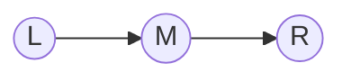
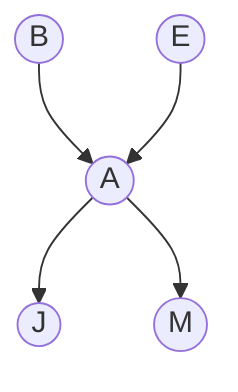

# Eliminación de Variables

> *"Simplicity is the ultimate sophistication."*
> — Leonardo da Vinci

---

## La ineficiencia de la enumeración

Recordemos el problema. Para calcular $P(Q \mid E = e)$ por enumeración, hacemos:

$$P(Q, E = e) = \sum_{h_1} \sum_{h_2} \cdots \sum_{h_k} \prod_{i=1}^{n} P(X_i \mid \text{Padres}(X_i))$$

El problema es que evaluamos el **producto completo** para cada combinación de variables ocultas. Pero muchos de esos factores **no dependen** de todas las variables ocultas.

### La idea clave: mover las sumas hacia adentro

Considera esta expresión con tres variables:

$$\sum_c \sum_b P(a) \cdot P(b \mid a) \cdot P(c \mid b)$$

En la enumeración, para cada par $(b, c)$ multiplicamos los tres factores. Pero $P(a)$ no depende de $b$ ni de $c$. Y $P(b \mid a)$ no depende de $c$. Podemos reorganizar:

$$P(a) \cdot \sum_b P(b \mid a) \cdot \sum_c P(c \mid b)$$

Ahora:
1. Primero calculamos $\sum_c P(c \mid b)$ para cada valor de $b$ (esto da 1 por normalización, pero en general puede ser una función de $b$).
2. Luego multiplicamos por $P(b \mid a)$ y sumamos sobre $b$.
3. Finalmente multiplicamos por $P(a)$.

En vez de evaluar $d^2$ combinaciones de $(b, c)$ con un producto de 3 factores, hacemos $d$ operaciones para eliminar $c$, y luego $d$ operaciones para eliminar $b$. Pasamos de $O(d^2)$ a $O(2d)$.

**Esta es la idea central de la eliminación de variables: empujar cada suma lo más adentro posible, para que cada suma solo involucre los factores que dependen de esa variable.**

---

## Factores

Para formalizar la eliminación de variables, necesitamos el concepto de **factor**.

### Definición

Un **factor** es una función que asigna un número real no negativo a cada combinación de valores de sus variables. Se puede pensar como una tabla.

**Ejemplo:** El factor $f(A, B)$ podría ser:

| $A$ | $B$ | $f(A, B)$ |
|:---:|:---:|:---------:|
| sí | sí | 0.3 |
| sí | no | 0.7 |
| no | sí | 0.1 |
| no | no | 0.9 |

Los factores **no** necesitan sumar 1 (no son distribuciones de probabilidad necesariamente). Las CPTs son un tipo especial de factor.

### Operaciones sobre factores

Necesitamos dos operaciones:

#### 1. Multiplicación de factores (pointwise product)

Dados dos factores $f_1(A, B)$ y $f_2(B, C)$, su producto es un nuevo factor $f_3(A, B, C)$:

$$f_3(A, B, C) = f_1(A, B) \cdot f_2(B, C)$$

Se multiplican las entradas que coinciden en las variables compartidas ($B$ en este caso).

**Ejemplo:**

$f_1(A, B)$:

| $A$ | $B$ | $f_1$ |
|:---:|:---:|:-----:|
| 0 | 0 | 0.3 |
| 0 | 1 | 0.7 |
| 1 | 0 | 0.6 |
| 1 | 1 | 0.4 |

$f_2(B, C)$:

| $B$ | $C$ | $f_2$ |
|:---:|:---:|:-----:|
| 0 | 0 | 0.2 |
| 0 | 1 | 0.8 |
| 1 | 0 | 0.5 |
| 1 | 1 | 0.5 |

$f_3(A, B, C) = f_1(A, B) \times f_2(B, C)$:

| $A$ | $B$ | $C$ | $f_1$ | $f_2$ | $f_3 = f_1 \times f_2$ |
|:---:|:---:|:---:|:-----:|:-----:|:-----:|
| 0 | 0 | 0 | 0.3 | 0.2 | 0.06 |
| 0 | 0 | 1 | 0.3 | 0.8 | 0.24 |
| 0 | 1 | 0 | 0.7 | 0.5 | 0.35 |
| 0 | 1 | 1 | 0.7 | 0.5 | 0.35 |
| 1 | 0 | 0 | 0.6 | 0.2 | 0.12 |
| 1 | 0 | 1 | 0.6 | 0.8 | 0.48 |
| 1 | 1 | 0 | 0.4 | 0.5 | 0.20 |
| 1 | 1 | 1 | 0.4 | 0.5 | 0.20 |

#### 2. Marginalización (sum out)

Dado un factor $f(A, B)$, marginalizar $B$ produce un nuevo factor $g(A)$:

$$g(A) = \sum_{b} f(A, B = b)$$

**Ejemplo:** Marginalizar $B$ de $f_1(A, B)$:

$$g(A=0) = f_1(0, 0) + f_1(0, 1) = 0.3 + 0.7 = 1.0$$

$$g(A=1) = f_1(1, 0) + f_1(1, 1) = 0.6 + 0.4 = 1.0$$

El factor resultante $g(A)$ solo depende de $A$.

#### 3. Restricción (observar evidencia)

Dado un factor $f(A, B)$ y la evidencia $B = 1$, la restricción produce:

$$f(A, B=1)$$

Simplemente seleccionamos las filas donde $B = 1$. El resultado es un factor que solo depende de $A$.

| $A$ | $f(A, B=1)$ |
|:---:|:----------:|
| 0 | 0.7 |
| 1 | 0.4 |

---

## El algoritmo de Eliminación de Variables

### 1) Lenguaje natural

La eliminación de variables evita enumerar todas las combinaciones ocultas. En lugar de eso:
1. Convierte la red en una lista de factores (las CPTs).
2. Incorpora evidencia restringiendo factores.
3. Elimina cada variable oculta del orden elegido:
   - junta factores que la mencionan,
   - los multiplica,
   - marginaliza esa variable,
   - devuelve el nuevo factor a la lista.
4. Multiplica los factores restantes y normaliza sobre \(Q\).

### 2) Matemática

Dado un query \(P(Q \mid \mathcal{E}=e)\), con ocultas \(H\):

$$
P(Q \mid \mathcal{E}=e) \propto \sum_H \prod_i f_i.
$$

Si eliminamos una variable \(Z\), definimos:

$$
g(\mathbf{Y}) \;=\; \sum_{z}\;\prod_{f \in \mathcal{F}_Z} f,
$$

donde \(\mathcal{F}_Z\) son los factores que contienen \(Z\), y \(\mathbf{Y}\) son las variables que quedan en ese producto tras eliminar \(Z\).

La operación se repite para cada variable del orden de eliminación.

### 3) Traza conceptual mínima

```text
factores = CPTs
factores <- restringir evidencia
para Z en orden:
    relevantes = factores que contienen Z
    producto = multiplicar(relevantes)
    nuevo = sumar_fuera(producto, Z)
    factores <- (factores \ relevantes) ∪ {nuevo}
resultado_no_norm = multiplicar(factores)
posterior = normalizar(resultado_no_norm)
```

### 4) Pseudocódigo

```text
FUNCIÓN EliminaciónDeVariables(Q, e, red, orden):
    // Q: variable de consulta
    // e: evidencia observada (diccionario variable -> valor)
    // red: red Bayesiana
    // orden: variables ocultas en orden de eliminación

    factores ← copia de todas las CPTs de la red

    // 1) Incorporar evidencia
    PARA CADA variable Ev en claves(e):
        PARA CADA factor f en factores que contiene Ev:
            reemplazar f por Restringir(f, Ev, e[Ev])

    // 2) Eliminar ocultas
    PARA CADA variable Z en orden:
        relevantes ← [f en factores | Z ∈ Vars(f)]
        SI relevantes está vacío:
            CONTINUAR

        factores ← factores sin relevantes
        producto ← MultiplicarTodos(relevantes)
        nuevo ← SumarFuera(producto, Z)   // marginalizar Z
        agregar nuevo a factores

    // 3) Combinar y normalizar sobre Q
    resultado_no_norm ← MultiplicarTodos(factores)
    RETORNAR NormalizarSobre(resultado_no_norm, Q)
```

**Homologación de variables (matemática ↔ código):**
- \(Q\) ↔ `Q` (variable de consulta)
- \(\mathcal{E}=e\) ↔ `e` (evidencia observada)
- \(H\) ↔ `orden` (ocultas a eliminar)
- \(\mathcal{F}_Z\) ↔ `relevantes`
- \(g(\mathbf{Y})\) ↔ `nuevo`

---

## Ejemplo completo: Lluvia → Mojado → Resbalón

Calculemos $P(L \mid R = \text{sí})$ usando eliminación de variables.

**Red:**



**CPTs como factores iniciales:**

$f_L(L)$:

| $L$ | $f_L$ |
|:---:|:-----:|
| sí | 0.3 |
| no | 0.7 |

$f_{M \mid L}(L, M)$:

| $L$ | $M$ | $f_{M \mid L}$ |
|:---:|:---:|:-----:|
| sí | sí | 0.9 |
| sí | no | 0.1 |
| no | sí | 0.2 |
| no | no | 0.8 |

$f_{R \mid M}(M, R)$:

| $M$ | $R$ | $f_{R \mid M}$ |
|:---:|:---:|:-----:|
| sí | sí | 0.7 |
| sí | no | 0.3 |
| no | sí | 0.1 |
| no | no | 0.9 |

### Capa 1: Lenguaje natural

1. Convertimos CPTs en factores.
2. Fijamos la evidencia \(R=\text{sí}\) (restricción).
3. Eliminamos la oculta \(M\): multiplicar factores que contienen \(M\), luego sumar sobre \(M\).
4. Multiplicamos el factor resultante con \(f_L(L)\) y normalizamos.

### Capa 2: Matemática del ejemplo

Con evidencia \(R=\text{sí}\):

$$
P(L \mid R=\text{sí}) \propto f_L(L)\;\sum_m f_{M\mid L}(L,m)\,f_{R\mid M}(m,R=\text{sí}).
$$

La normalización final divide por la suma sobre \(L\in\{\text{sí},\text{no}\}\).

### Capa 3: Traza numérica del ejemplo

#### Paso 1: Incorporar evidencia $R = \text{sí}$

Restringimos $f_{R \mid M}$ a $R = \text{sí}$:

$f_{R \mid M}(M, R=\text{sí})$ → nuevo factor $f'_R(M)$:

| $M$ | $f'_R$ |
|:---:|:-----:|
| sí | 0.7 |
| no | 0.1 |

**Factores actuales:** $f_L(L)$, $f_{M \mid L}(L, M)$, $f'_R(M)$

#### Paso 2: Eliminar la variable oculta $M$

**Orden de eliminación:** solo hay una variable oculta ($M$), así que la eliminamos.

**Reunir factores que mencionan $M$:** $f_{M \mid L}(L, M)$ y $f'_R(M)$.

**Multiplicar:**

$f_4(L, M) = f_{M \mid L}(L, M) \times f'_R(M)$:

| $L$ | $M$ | $f_{M \mid L}$ | $f'_R$ | $f_4 = f_{M \mid L} \times f'_R$ |
|:---:|:---:|:-----:|:-----:|:-----:|
| sí | sí | 0.9 | 0.7 | 0.63 |
| sí | no | 0.1 | 0.1 | 0.01 |
| no | sí | 0.2 | 0.7 | 0.14 |
| no | no | 0.8 | 0.1 | 0.08 |

**Marginalizar $M$:**

$f_5(L) = \sum_m f_4(L, M=m)$:

| $L$ | $f_5$ |
|:---:|:-----:|
| sí | $0.63 + 0.01 = 0.64$ |
| no | $0.14 + 0.08 = 0.22$ |

**Factores actuales:** $f_L(L)$, $f_5(L)$

#### Paso 3: Multiplicar factores restantes

$f_6(L) = f_L(L) \times f_5(L)$:

| $L$ | $f_L$ | $f_5$ | $f_6$ |
|:---:|:-----:|:-----:|:-----:|
| sí | 0.3 | 0.64 | 0.192 |
| no | 0.7 | 0.22 | 0.154 |

#### Paso 4: Normalizar

$$\alpha = \frac{1}{0.192 + 0.154} = \frac{1}{0.346}$$

| $L$ | $P(L \mid R=\text{sí})$ |
|:---:|:-----------------------:|
| sí | $0.192 / 0.346 \approx 0.555$ |
| no | $0.154 / 0.346 \approx 0.445$ |

El mismo resultado que por enumeración, pero con menos operaciones.

### Capa 4: Traza de código (mismo ejemplo)

```text
EliminaciónDeVariables(Q=L, e={R=sí}, red, orden=[M])
│
├── factores iniciales = [f_L(L), f_M|L(L,M), f_R|M(M,R)]
├── restringir evidencia R=sí:
│   f_R|M(M,R) -> f'_R(M)
│   factores = [f_L(L), f_M|L(L,M), f'_R(M)]
│
├── eliminar Z=M:
│   relevantes = [f_M|L(L,M), f'_R(M)]
│   producto = f_4(L,M)
│   nuevo = sum_M f_4(L,M) = f_5(L)
│   factores = [f_L(L), f_5(L)]
│
├── combinar restantes:
│   resultado_no_norm(L) = f_L(L) * f_5(L)
│   = {sí: 0.192, no: 0.154}
│
└── normalizar sobre L:
    posterior = {sí: 0.555, no: 0.445}
```

---

## Ejemplo: Eliminación en la red de Holmes

Calculemos $P(B \mid J = \text{sí}, M = \text{sí})$.



**Variables:** Consulta: $B$. Evidencia: $J = \text{sí}$, $M = \text{sí}$. Ocultas: $E$, $A$.

**Factores iniciales:** $f_B(B)$, $f_E(E)$, $f_{A \mid B,E}(A, B, E)$, $f_{J \mid A}(A, J)$, $f_{M \mid A}(A, M)$.

### Paso 1: Incorporar evidencia

- Restringir $f_{J \mid A}$ a $J = \text{sí}$: obtenemos $f'_J(A)$

| $A$ | $f'_J$ |
|:---:|:------:|
| sí | 0.90 |
| no | 0.05 |

- Restringir $f_{M \mid A}$ a $M = \text{sí}$: obtenemos $f'_M(A)$

| $A$ | $f'_M$ |
|:---:|:------:|
| sí | 0.70 |
| no | 0.01 |

**Factores:** $f_B(B)$, $f_E(E)$, $f_{A \mid B,E}(A, B, E)$, $f'_J(A)$, $f'_M(A)$.

### Paso 2: Eliminar $E$ (elegimos eliminar $E$ primero)

**Factores que mencionan $E$:** $f_E(E)$ y $f_{A \mid B,E}(A, B, E)$.

**Multiplicar:** $f_1(A, B, E) = f_E(E) \times f_{A \mid B,E}(A, B, E)$

(Esto simplemente pondera cada fila de $f_{A \mid B,E}$ por la prior de $E$.)

| $B$ | $E$ | $A$ | $f_{A \mid B,E}$ | $f_E$ | $f_1$ |
|:---:|:---:|:---:|:---------:|:-----:|:-----:|
| sí | sí | sí | 0.95 | 0.002 | 0.0019 |
| sí | sí | no | 0.05 | 0.002 | 0.0001 |
| sí | no | sí | 0.94 | 0.998 | 0.9381 |
| sí | no | no | 0.06 | 0.998 | 0.0599 |
| no | sí | sí | 0.29 | 0.002 | 0.00058 |
| no | sí | no | 0.71 | 0.002 | 0.00142 |
| no | no | sí | 0.001 | 0.998 | 0.000998 |
| no | no | no | 0.999 | 0.998 | 0.99700 |

**Marginalizar $E$:** $f_2(A, B) = \sum_e f_1(A, B, E=e)$

| $B$ | $A$ | $f_2$ |
|:---:|:---:|:-----:|
| sí | sí | $0.0019 + 0.9381 = 0.9400$ |
| sí | no | $0.0001 + 0.0599 = 0.0600$ |
| no | sí | $0.00058 + 0.000998 = 0.001578$ |
| no | no | $0.00142 + 0.99700 = 0.998420$ |

### Paso 3: Eliminar $A$

**Factores que mencionan $A$:** $f_2(A, B)$, $f'_J(A)$, $f'_M(A)$.

**Multiplicar:** $f_3(A, B) = f_2(A, B) \times f'_J(A) \times f'_M(A)$

| $B$ | $A$ | $f_2$ | $f'_J$ | $f'_M$ | $f_3$ |
|:---:|:---:|:-----:|:------:|:------:|:-----:|
| sí | sí | 0.9400 | 0.90 | 0.70 | 0.59220 |
| sí | no | 0.0600 | 0.05 | 0.01 | 0.00003 |
| no | sí | 0.001578 | 0.90 | 0.70 | 0.000994 |
| no | no | 0.998420 | 0.05 | 0.01 | 0.000499 |

**Marginalizar $A$:** $f_4(B) = \sum_a f_3(A=a, B)$

| $B$ | $f_4$ |
|:---:|:-----:|
| sí | $0.59220 + 0.00003 = 0.59223$ |
| no | $0.000994 + 0.000499 = 0.001493$ |

### Paso 4: Multiplicar con $f_B(B)$ y normalizar

$f_5(B) = f_B(B) \times f_4(B)$:

| $B$ | $f_B$ | $f_4$ | $f_5$ |
|:---:|:-----:|:-----:|:-----:|
| sí | 0.001 | 0.59223 | 0.000592 |
| no | 0.999 | 0.001493 | 0.001492 |

**Normalizar:**

$$P(B=\text{sí} \mid J=\text{sí}, M=\text{sí}) = \frac{0.000592}{0.000592 + 0.001492} = \frac{0.000592}{0.002084} \approx 0.284$$

Mismo resultado que la enumeración, confirmando la corrección del algoritmo.

---

## Cómo leer este algoritmo sin perderte

### Checklist mental (6 pasos)

1. Escribe factores iniciales (CPTs).
2. Restringe evidencia en todos los factores relevantes.
3. Elige una variable oculta \(Z\) según el orden.
4. Junta factores que contienen \(Z\), multiplícalos, marginaliza \(Z\).
5. Repite con la siguiente oculta.
6. Multiplica factores finales y normaliza sobre \(Q\).

### Invariante clave

Después de eliminar cualquier prefijo del orden, el producto de los factores actuales es proporcional a la distribución conjunta donde:
- la evidencia ya está incorporada, y
- las variables ya eliminadas fueron sumadas correctamente.

Por eso el resultado final, tras normalizar, coincide con el de enumeración.

### Errores comunes (y cómo evitarlos)

- **Eliminar una variable de consulta o evidencia**: el `orden` debe contener solo ocultas.
- **No restringir evidencia al inicio**: infla factores y rompe eficiencia.
- **Olvidar remover factores relevantes antes de agregar el nuevo**: duplica información.
- **Normalizar sobre todas las variables**: se normaliza sobre el dominio de \(Q\).
- **Orden de eliminación malo**: puede generar factores intermedios enormes.

---

## ¿Por qué es más eficiente?

### Enumeración vs Eliminación de Variables

En la enumeración de Holmes con $P(B \mid J{=}s, M{=}s)$:
- Variables ocultas: $E$, $A$ (ambas binarias)
- Combinaciones: $2^2 = 4$ por cada valor de $B$
- Total: $2 \times 4 = 8$ evaluaciones del producto completo (5 multiplicaciones cada una)
- **Operaciones: ~40**

En la eliminación de variables:
- Eliminar $E$: multiplicar 2 factores ($8$ filas), sumar ($4$ sumas) → ~12 operaciones
- Eliminar $A$: multiplicar 3 factores ($4$ filas, 3 mult. cada una), sumar ($2$ sumas) → ~14 operaciones
- Final: multiplicar 2 factores ($2$ mult.) + normalizar → ~4 operaciones
- **Operaciones: ~30**

Para esta red pequeña la diferencia es menor. Pero para redes grandes la diferencia es **exponencial**.

### Complejidad formal

La complejidad de la eliminación de variables depende del **ancho de árbol** (treewidth) del grafo, no del número total de variables ocultas:

| Algoritmo | Complejidad |
|-----------|------------|
| Enumeración | $O(n \cdot d^k)$ donde $k$ = variables ocultas |
| Eliminación de variables | $O(n \cdot d^{w+1})$ donde $w$ = ancho de árbol |

El ancho de árbol $w$ mide el factor más grande que se genera durante la eliminación. Depende de la **estructura del grafo** y del **orden de eliminación**.

- En un grafo tipo cadena: $w = 1$ → lineal
- En un grafo tipo árbol: $w = 1$ → lineal
- En un grafo denso: $w$ puede ser grande → vuelve a ser exponencial

**Elegir el orden óptimo** de eliminación (que minimiza $w$) es NP-hard, pero heurísticas simples (como eliminar primero las variables con menos conexiones) funcionan bien en la práctica.

---

## Conexión con independencia y Markov Blanket

La eliminación de variables es eficiente **precisamente** porque aprovecha las independencias condicionales del grafo.

Cuando eliminamos una variable $H$:
- Solo necesitamos los factores que **mencionan** $H$
- Estos factores corresponden a $H$ y su **Markov blanket**
- Las variables fuera del Markov blanket de $H$ no participan

Si el Markov blanket de cada variable es pequeño (el grafo es "sparse"), cada paso de eliminación involucra pocos factores y la eliminación es eficiente.

Si el Markov blanket es grande (el grafo es denso), los factores intermedios crecen y la eliminación pierde su ventaja.

---

## Resumen del módulo

| Sección | Concepto clave |
|---------|---------------|
| 10.1 | Una red Bayesiana = DAG + CPTs = factorización compacta de la conjunta |
| 10.2 | Un query clasifica variables en consulta, evidencia y ocultas |
| 10.3 | Enumeración: fuerza bruta, $O(d^k)$, correcto pero exponencial |
| 10.4 | d-separación y Markov blanket revelan independencias del grafo |
| 10.5 | Eliminación de variables: empuja sumas adentro, $O(d^{w+1})$ |

La progresión lógica:

```
Conjunta exponencial → Factorización (red) → Queries (inferencia)
    → Fuerza bruta (lento) → Independencias (insight) → Eliminación (eficiente)
```

---

:::exercise{title="Eliminación de variables paso a paso"}

Usa la red de diagnóstico médico (con las CPTs de la sección 10.2) para calcular:

$$P(G = \text{sí} \mid T = \text{sí}, Fi = \text{sí})$$

"Si el paciente tose y tiene fiebre, ¿cuál es la probabilidad de que tenga gripe?"

**Pasos sugeridos:**

1. Identifica las variables: consulta ($G$), evidencia ($T$, $Fi$), ocultas ($F$, $N$).
2. Escribe los factores iniciales y restringe la evidencia.
3. Elige un orden de eliminación para las ocultas (sugiero: primero $F$, luego $N$).
4. Elimina $F$: junta los factores que mencionan $F$, multiplica, marginaliza.
5. Elimina $N$: junta los factores que mencionan $N$, multiplica, marginaliza.
6. Multiplica los factores restantes y normaliza.
:::

<details>
<summary><strong>Ver Respuestas</strong></summary>

**Factores iniciales:**
- $f_F(F)$: $P(F{=}s) = 0.20$, $P(F{=}n) = 0.80$
- $f_G(G)$: $P(G{=}s) = 0.10$, $P(G{=}n) = 0.90$
- $f_{N \mid F}(F, N)$: $P(N{=}s \mid F{=}s) = 0.15$, $P(N{=}s \mid F{=}n) = 0.02$
- $f_{T \mid G,N}(G, N, T)$: restringir a $T{=}s$
- $f_{Fi \mid G,N}(G, N, Fi)$: restringir a $Fi{=}s$

**Incorporar evidencia $T{=}s$, $Fi{=}s$:**

$f'_T(G, N)$:

| $G$ | $N$ | $f'_T$ |
|:---:|:---:|:------:|
| sí | sí | 0.95 |
| sí | no | 0.80 |
| no | sí | 0.60 |
| no | no | 0.05 |

$f'_{Fi}(G, N)$:

| $G$ | $N$ | $f'_{Fi}$ |
|:---:|:---:|:---------:|
| sí | sí | 0.95 |
| sí | no | 0.85 |
| no | sí | 0.70 |
| no | no | 0.01 |

**Eliminar $F$:**

Factores con $F$: $f_F(F)$, $f_{N \mid F}(F, N)$.

Multiplicar: $f_1(F, N) = f_F(F) \times f_{N \mid F}(F, N)$

| $F$ | $N$ | $f_1$ |
|:---:|:---:|:-----:|
| sí | sí | $0.20 \times 0.15 = 0.030$ |
| sí | no | $0.20 \times 0.85 = 0.170$ |
| no | sí | $0.80 \times 0.02 = 0.016$ |
| no | no | $0.80 \times 0.98 = 0.784$ |

Marginalizar $F$: $f_2(N) = \sum_f f_1(F{=}f, N)$

| $N$ | $f_2$ |
|:---:|:-----:|
| sí | $0.030 + 0.016 = 0.046$ |
| no | $0.170 + 0.784 = 0.954$ |

**Eliminar $N$:**

Factores con $N$: $f_2(N)$, $f'_T(G, N)$, $f'_{Fi}(G, N)$.

Multiplicar: $f_3(G, N) = f_2(N) \times f'_T(G, N) \times f'_{Fi}(G, N)$

| $G$ | $N$ | $f_2$ | $f'_T$ | $f'_{Fi}$ | $f_3$ |
|:---:|:---:|:-----:|:------:|:---------:|:-----:|
| sí | sí | 0.046 | 0.95 | 0.95 | 0.04153 |
| sí | no | 0.954 | 0.80 | 0.85 | 0.64872 |
| no | sí | 0.046 | 0.60 | 0.70 | 0.01932 |
| no | no | 0.954 | 0.05 | 0.01 | 0.000477 |

Marginalizar $N$: $f_4(G) = \sum_n f_3(G, N{=}n)$

| $G$ | $f_4$ |
|:---:|:-----:|
| sí | $0.04153 + 0.64872 = 0.69025$ |
| no | $0.01932 + 0.000477 = 0.01980$ |

**Multiplicar con $f_G(G)$ y normalizar:**

$f_5(G) = f_G(G) \times f_4(G)$:

| $G$ | $f_G$ | $f_4$ | $f_5$ |
|:---:|:-----:|:-----:|:-----:|
| sí | 0.10 | 0.69025 | 0.06903 |
| no | 0.90 | 0.01980 | 0.01782 |

$$P(G{=}s \mid T{=}s, Fi{=}s) = \frac{0.06903}{0.06903 + 0.01782} = \frac{0.06903}{0.08685} \approx 0.795$$

**Interpretación:** La prior de gripe es solo 10%, pero al observar tos y fiebre, la probabilidad sube a ~80%. Los síntomas son evidencia fuerte de la gripe.

</details>

---

**Anterior:** [Independencia y Markov Blanket](04_independencia_y_markov.md) | **Inicio:** [Redes Bayesianas](00_index.md)
