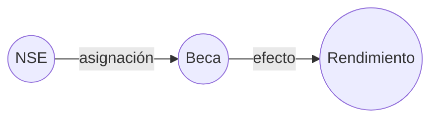
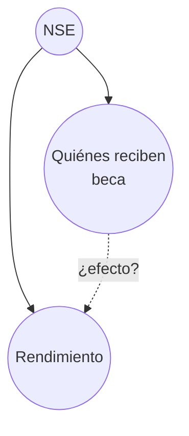
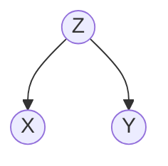
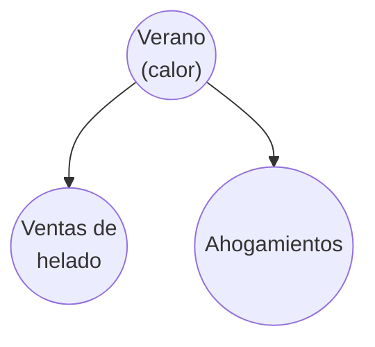
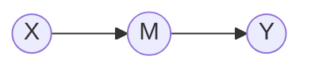
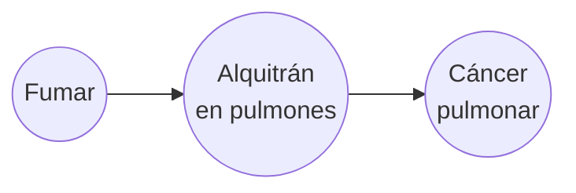
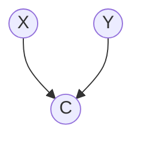
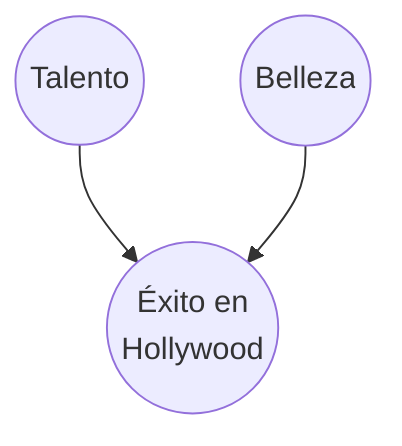

# Estructuras Causales

> *"No amount of experimentation can ever prove me right; a single experiment can prove me wrong."*
> — Albert Einstein

---

## La Paradoja de Simpson

Una universidad quiere saber si sus becas mejoran el rendimiento académico. Compara a los estudiantes con beca y sin beca:

| | Estudiantes | Promedio alto | Tasa |
|---|---:|---:|---:|
| **Con beca** | 1,000 | 660 | **66%** |
| **Sin beca** | 1,000 | 740 | **74%** |

Los becados rinden peor. ¿Las becas perjudican el rendimiento?

Pero al desglosar por **nivel socioeconómico (NSE)**, la historia cambia completamente:

| NSE | Con beca (promedio alto) | Sin beca (promedio alto) |
|:---:|:---:|:---:|
| Bajo | 480/800 = **60%** | 100/200 = 50% |
| Alto | 180/200 = **90%** | 640/800 = 80% |

Dentro de cada grupo de NSE, los becados rinden **mejor**. ¿Cómo es posible que los datos agregados digan lo contrario?

La respuesta: **la mayoría de las becas se asignan a estudiantes de NSE bajo**, que tienen menor rendimiento de base. En el agregado, el grupo "con beca" está dominado por estudiantes de NSE bajo, y el grupo "sin beca" por estudiantes de NSE alto. Pero, ¿cuál es exactamente la estructura causal? Depende de cómo modelemos el problema — y esto tiene consecuencias:

**Interpretación 1 (chain — mediación):** El NSE determina quién recibe beca, y la beca mejora el rendimiento. Aquí la beca es un **mediador**:

En esta lectura, la pregunta "¿las becas ayudan?" se responde mirando el **efecto directo** de la beca sobre el rendimiento *dentro* de cada nivel de NSE. Desglosar por NSE es correcto porque queremos aislar ese efecto directo.

**Interpretación 2 (fork — confounding):** El NSE influye tanto en quién recibe beca como en el rendimiento. Aquí el NSE es un **confounder**:

En esta lectura, desglosar por NSE **ajusta por el confounder** y elimina la correlación espuria.

**La lección clave:** ambas interpretaciones conducen a la misma acción (desglosar por NSE), pero por **razones causales distintas** (aislar el efecto directo vs. eliminar confounding). Los datos no distinguen entre ellas — necesitas **conocimiento del dominio** para decidir cuál DAG es correcto. Este es un tema central del módulo: la causalidad viene del modelo, no de los datos.

Para el resto del módulo adoptaremos la **interpretación fork** (NSE como confounder), que es la más usada en la literatura y la que motiva la fórmula de ajuste.

Esta paradoja no es un caso aislado. Aparece en:

- **Ensayos clínicos:** un tratamiento parece peor en el agregado pero mejor dentro de cada subgrupo
- **Eficacia de vacunas:** tasas de hospitalización que se invierten al estratificar por edad
- **Estadísticas deportivas:** un bateador con peor promedio general pero mejor en cada temporada individual

En todos los casos, la estructura es la misma: **una variable oculta invierte la conclusión cuando se ignora**. Para resolver esta paradoja, necesitamos un lenguaje formal para hablar de causa y efecto.

---

## Grafos causales como lenguaje

Un **grafo causal** es un grafo dirigido acíclico (DAG) donde:

- Cada **nodo** representa una variable
- Cada **flecha** $X \rightarrow Y$ significa: "$X$ es causa directa de $Y$"

Esto es diferente de decir "$X$ e $Y$ están correlacionados". La dirección importa: una flecha es una **afirmación sobre el mecanismo del mundo**, no solo un patrón en los datos.

:::example{title="Correlación vs. Causalidad"}
Estos dos grafos producen la misma correlación entre $X$ e $Y$, pero cuentan historias causales completamente distintas:

**Grafo A:** $X \rightarrow Y$ — "X causa Y"

**Grafo B:** $X \leftarrow Z \rightarrow Y$ — "X e Y están correlacionados, pero ninguno causa al otro"

Los datos solos no distinguen entre A y B. Necesitas **conocimiento del dominio** para decidir cuál es correcto.
:::

Para razonar sobre causalidad con grafos, necesitamos entender tres patrones fundamentales.

---

## Las tres estructuras fundamentales

Todo grafo causal, por complejo que sea, se compone de combinaciones de **tres estructuras básicas** de tres nodos. Cada una tiene un comportamiento distinto respecto a las correlaciones que genera.

### 1. Fork (bifurcación) — Confounding

Una **causa común** $Z$ genera correlación entre $X$ e $Y$, aunque $X$ no cause $Y$ ni viceversa.

:::example{title="Fork: helado y ahogamientos"}
Cada verano, las ventas de helado y los ahogamientos en piscinas **suben juntos**. ¿El helado causa ahogamientos?

No. El **verano** (calor) es la causa común: la gente come más helado Y nada más. Si controlas por la temporada (solo miras datos de julio), la correlación entre helado y ahogamientos **desaparece**.

$Z$ es un **confounder** (variable de confusión): crea una correlación espuria entre $X$ e $Y$.
:::

:::example{title="¿Qué significa 'condicionar en Z'?"}
"Condicionar en $Z$" tiene tres interpretaciones equivalentes en la práctica:

1. **Estratificar:** dividir los datos en subgrupos donde $Z$ tiene el mismo valor y analizar cada subgrupo por separado
2. **Controlar:** incluir $Z$ como covariable en una regresión ($Y \sim X + Z$), que calcula el efecto de $X$ "a igualdad de $Z$"
3. **Filtrar:** mirar solo los datos donde $Z = z$ (para un valor fijo $z$)

En la paradoja de Simpson, "condicionar en NSE" = analizar cada nivel socioeconómico por separado. Dentro de cada grupo de NSE, la correlación espuria entre beca y rendimiento desaparece.
:::

**Regla del fork:** $X$ e $Y$ están correlacionados. Pero si condicionamos en $Z$ (fijamos su valor), la correlación **desaparece**:

$$X \not\perp Y \quad \text{pero} \quad X \perp Y \mid Z$$

**Intuición:** la correlación entre $X$ e $Y$ existe *solo* porque comparten la causa $Z$. Una vez que controlas por $Z$, no queda nada.

---

### 2. Chain (cadena) — Mediación

$X$ causa $Y$, pero **a través de** un intermediario $M$.

:::example{title="Chain: fumar y cáncer"}

Fumar causa cáncer, pero el mecanismo pasa por la acumulación de alquitrán. Si pudieras fijar el nivel de alquitrán (hipotéticamente), fumar ya no predeciría cáncer.
:::

**Regla de la cadena:** $X$ e $Y$ están correlacionados (porque $X$ causa $Y$ vía $M$). Pero si condicionamos en $M$, la correlación **se bloquea**:

$$X \not\perp Y \quad \text{pero} \quad X \perp Y \mid M$$

**Intuición:** $M$ es el *canal* por el que fluye la influencia de $X$ a $Y$. Si fijas $M$, cortas el canal.

---

### 3. Collider (colisionador) — Selection Bias

Dos causas independientes $X$ e $Y$ comparten un **efecto común** $C$.

:::example{title="Collider: Hollywood"}

En la **población general**, talento y belleza son independientes: una persona puede ser talentosa sin ser guapa y viceversa.

Pero si solo miras **actores exitosos en Hollywood** (condicionas en $C =$ éxito), parece que los más talentosos son menos guapos y viceversa. ¿Por qué?

Porque para tener éxito necesitas talento **o** belleza (o ambos). Si alguien exitoso no es guapo, *probablemente* es muy talentoso (y viceversa). Condicionar en el efecto común **crea una correlación que no existía**.

Esto se conoce como **selection bias** (sesgo de selección) o **explaining away**.
:::

**Regla del collider:** $X$ e $Y$ son independientes. Pero si condicionamos en $C$, **se crea** una correlación:

$$X \perp Y \quad \text{pero} \quad X \not\perp Y \mid C$$

**Intuición:** el collider es lo opuesto al fork. El fork crea correlación que se destruye al condicionar. El collider destruye independencia al condicionar.

---

## Resumen de las tres estructuras

| Estructura | Grafo | Sin condicionar | Condicionando en el nodo central |
|---|---|:---:|:---:|
| **Fork** | $X \leftarrow Z \rightarrow Y$ | Correlacionados | **Independientes** |
| **Chain** | $X \rightarrow M \rightarrow Y$ | Correlacionados | **Independientes** |
| **Collider** | $X \rightarrow C \leftarrow Y$ | **Independientes** | Correlacionados |

**Patrón clave:** En forks y chains, observar el nodo central **bloquea** el flujo de información. En colliders, observar el nodo central **abre** el flujo de información.

---

## d-separación: la regla general

Las tres estructuras son los bloques de un concepto más general: **d-separación** (separación direccional). En un DAG arbitrario (con muchos nodos y flechas), dos variables $X$ e $Y$ están **d-separadas** por un conjunto de variables $S$ si **todo camino** entre $X$ e $Y$ está "bloqueado" por $S$.

Un camino entre $X$ e $Y$ está **bloqueado** por $S$ si contiene al menos un nodo que cumple:

| Tipo de nodo en el camino | Condición para bloquear |
|---|---|
| **No-collider** (fork o chain) | El nodo **está en** $S$ — condicionar bloquea el flujo |
| **Collider** | El nodo **no está en** $S$ **y** ningún **descendiente** del nodo está en $S$ |

Si $X$ e $Y$ están d-separados por $S$, entonces: $X \perp Y \mid S$.

**Nota importante sobre descendientes:** condicionar en un **descendiente** de un collider también "abre" el camino, igual que condicionar en el collider mismo. Por ejemplo, si $X \rightarrow C \leftarrow Y$ y $C \rightarrow D$, condicionar en $D$ también crea correlación entre $X$ e $Y$.

Esta regla generaliza las tres estructuras básicas a grafos de cualquier tamaño y es la base del **criterio backdoor** que veremos en la [siguiente sección](02_do_y_causalidad.md).

---

:::exercise{title="¿Qué estructura es?"}

Para cada situación, identifica si es un **fork**, **chain** o **collider**. Dibuja el grafo.

1. **Ejercicio causa sudoración.** Sudoración causa deshidratación. ¿Qué relación hay entre ejercicio y deshidratación?

2. **La lluvia causa tráfico.** La lluvia causa paraguas mojados. ¿Los paraguas mojados predicen tráfico?

3. **Habilidad atlética mejora la nota de admisión.** Buen expediente académico mejora la nota de admisión. ¿Qué pasa si solo observas a los alumnos admitidos?

4. **Presupuesto de marketing aumenta ventas.** Ventas altas aumentan el precio de la acción. ¿Marketing está correlacionado con el precio de la acción?

5. **Fumar causa tos.** Un resfriado causa tos. ¿Los fumadores se resfrían más?
:::

<strong>Ver Respuestas</strong>

1. **Chain:** Ejercicio → Sudoración → Deshidratación. Ejercicio causa deshidratación a través de la sudoración. Si controlas por sudoración, ejercicio y deshidratación se vuelven independientes.

2. **Fork:** Lluvia → Tráfico, Lluvia → Paraguas mojados. La lluvia es la causa común. Si sabes que llovió, saber que hay paraguas mojados no te dice nada nuevo sobre el tráfico.

3. **Collider:** Atletismo → Admisión ← Expediente. Entre la población general, atletismo y expediente son independientes. Pero entre los admitidos, parecen negativamente correlacionados (si no es atleta, probablemente tiene buen expediente).

4. **Chain:** Marketing → Ventas → Precio de acción. Marketing causa precio a través de ventas. Si controlas por ventas, marketing y precio se vuelven independientes.

5. **Collider:** Fumar → Tos ← Resfriado. Fumar y resfriarse son independientes. Pero si sabes que alguien tose y no fuma, es más probable que tenga resfriado.

---

**Anterior:** [Grafos Causales — Índice](00_index.md) | **Siguiente:** [Causalidad y el Operador do →](02_do_y_causalidad.md)
