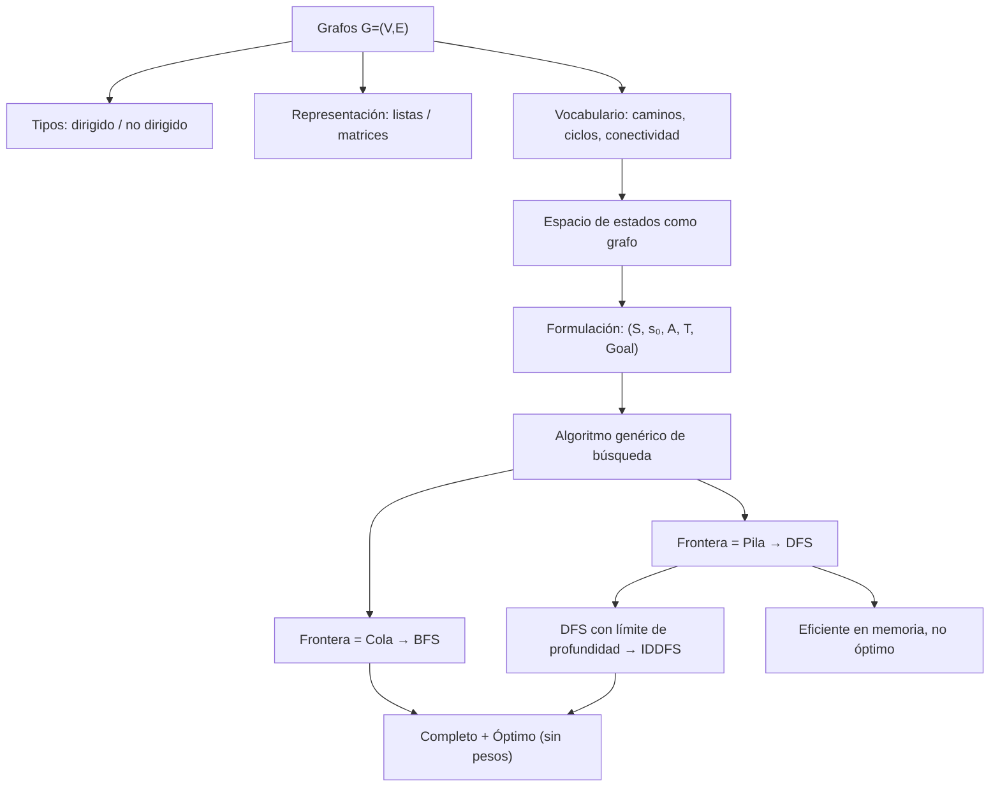

# Búsqueda Simple

> *"The question of whether a computer can think is no more interesting than the question of whether a submarine can swim."*
> — Edsger W. Dijkstra

Hemos modelado agentes que perciben y actúan. Hemos estudiado lógica, probabilidad y optimización. Pero hay una pregunta que todos estos marcos comparten: **¿cómo encuentra un agente el camino hacia su objetivo?**

La respuesta es búsqueda. Y la idea central es sorprendentemente simple: un agente que busca tiene un **espacio de estados** — un grafo donde los nodos son configuraciones posibles del mundo y las aristas son acciones — y su tarea es encontrar un camino desde el estado inicial hasta un estado que satisfaga su objetivo.

Este módulo construye esa maquinaria desde cero: primero la teoría de grafos necesaria, luego la formulación de problemas como espacios de estado, y finalmente el algoritmo genérico del que BFS, DFS e IDDFS son instancias concretas.

## Contenido

| Sección | Tema | Idea clave |
|:-------:|------|-----------|
| 13.1 | [Grafos: fundamentos](01_grafos.md) | $G=(V,E)$, tipos, representaciones, complejidad |
| 13.2 | [Espacio de estados](02_espacio_de_estados.md) | Problema como grafo: estados, acciones, objetivo |
| 13.3 | [Algoritmo genérico de búsqueda](03_busqueda_generica.md) | Una función, muchos algoritmos — solo cambia la frontera |
| 13.4 | [Búsqueda en amplitud (BFS)](04_bfs.md) | Cola → nivel a nivel → óptimo en grafos sin pesos |
| 13.5 | [Búsqueda en profundidad (DFS)](05_dfs.md) | Pila → profundidad primero → eficiente en memoria |
| 13.6 | [IDDFS y comparación](06_iddfs_y_comparacion.md) | Lo mejor de ambos mundos; tabla de decisión |

## Materiales y flujo de trabajo

| Paso | Material | Colab | Descripción |
|:----:|---------|:-----:|-------------|
| 1 | [13.1 Grafos](01_grafos.md) | — | Teoría: $G=(V,E)$, tipos, representaciones |
| 2 | [13.2 Espacio de estados](02_espacio_de_estados.md) | — | Formulación de problemas como grafos |
| 3 | [13.3 Algoritmo genérico](03_busqueda_generica.md) | — | La abstracción central: frontera + explorado |
| 4 | [Notebook 01 — Grafos](notebooks/01_grafos.ipynb) | <a href="https://colab.research.google.com/github/sonder-art/ia_p26/blob/main/clase/13_simple_search/notebooks/01_grafos.ipynb" target="_blank"></a> | Construir, visualizar y representar grafos en Python |
| 5 | [13.4 BFS](04_bfs.md) | — | Búsqueda en amplitud: intuición, pseudocódigo, complejidad |
| 6 | [13.5 DFS](05_dfs.md) | — | Búsqueda en profundidad: intuición, pseudocódigo, complejidad |
| 7 | [13.6 IDDFS y comparación](06_iddfs_y_comparacion.md) | — | IDDFS, tabla comparativa, guía de uso |
| 8 | [Notebook 02 — Búsqueda](notebooks/02_busqueda.ipynb) | <a href="https://colab.research.google.com/github/sonder-art/ia_p26/blob/main/clase/13_simple_search/notebooks/02_busqueda.ipynb" target="_blank"></a> | BFS, DFS, IDDFS paso a paso en laberintos |
| 9 | Notebook de aplicación (elige uno) | — | Exploración profunda en un dominio |

### Notebooks de aplicación

Elige **uno** de los siguientes:

| Notebook | Tema | Herramientas | Colab |
|---------|------|-------------|:-----:|
| [03 — Laberintos](notebooks/aplicaciones/03_laberintos.ipynb) | Generar y resolver laberintos perfectos; comparar BFS y DFS | numpy, matplotlib | <a href="https://colab.research.google.com/github/sonder-art/ia_p26/blob/main/clase/13_simple_search/notebooks/aplicaciones/03_laberintos.ipynb" target="_blank"></a> |
| [04 — Coloreo de imagen](notebooks/aplicaciones/04_coloreo_imagen.ipynb) | Flood fill y segmentación de regiones en grillas de píxeles | numpy, matplotlib | <a href="https://colab.research.google.com/github/sonder-art/ia_p26/blob/main/clase/13_simple_search/notebooks/aplicaciones/04_coloreo_imagen.ipynb" target="_blank"></a> |

## Objetivos de aprendizaje

Al terminar este módulo podrás:

1. **Definir** formalmente un grafo $G=(V,E)$, distinguir grafos dirigidos de no dirigidos, y simples de multigrafos
2. **Comparar** representaciones de grafos (lista de adyacencia vs. matriz) y elegir la apropiada según densidad
3. **Formular** cualquier problema de búsqueda como un espacio de estados $(S, s_0, A, T, \text{Goal})$ y construir el grafo correspondiente
4. **Explicar** el algoritmo genérico de búsqueda y por qué BFS y DFS son instancias del mismo algoritmo con fronteras distintas
5. **Implementar** `QueueFrontier`, `StackFrontier` y `DepthLimitedFrontier` como plug-ins del algoritmo genérico
6. **Analizar** BFS y DFS en términos de completitud, optimalidad y complejidad de tiempo y espacio
7. **Aplicar** IDDFS cuando se necesitan las garantías de BFS con la eficiencia de memoria de DFS
8. **Seleccionar** el algoritmo adecuado dado un problema concreto usando la tabla comparativa

## Prerrequisitos

| Concepto | Módulo |
|----------|--------|
| Agentes, environments, racionalidad | [02 — Agentes y Ambientes](../02_agentes_&_ambientes/00_index.md) |
| Complejidad computacional, notación $O$ | [04 — Computabilidad y Complejidad](../04_computabilidad_complejidad/00_index.md) |

## Mapa conceptual



## Cómo ejecutar el script de imágenes

```bash
cd clase/13_simple_search
python3 lab_search.py
```

Dependencias: `numpy`, `matplotlib` (ver `requirements.txt`).
