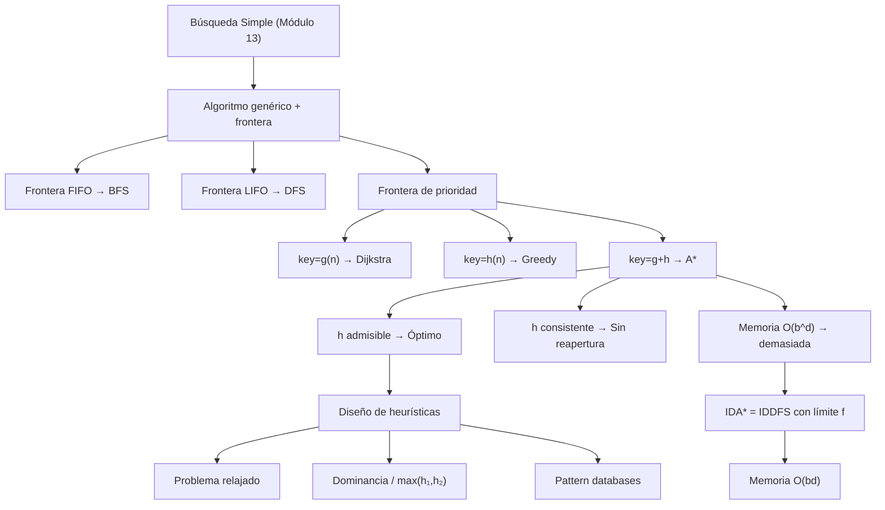

:::exam{id="EX-06" title="Parcial: Redes Bayesianas, Causalidad, Búsqueda Simple y Búsqueda Informada" date="2026-03-18" points="10" duration="20 minutos"}
**Temas evaluados:**
- Módulo 10: Redes Bayesianas
- Módulo 11: Grafos Causales y Causalidad
- Módulo 13: Búsqueda Simple (BFS, DFS, IDDFS)
- Módulo 14: Búsqueda Informada (Dijkstra, A\*, heurísticas)
:::

:::homework{id="hw-modulos-redes-busqueda" title="Tarea Integradora: Redes Bayesianas, Causalidad, Búsqueda Simple y Búsqueda Informada" due="2026-03-18" points="80"}
Entrega los notebooks de los cuatro módulos (20 puntos cada uno):

- **Módulo 10 — Redes Bayesianas (20 pts):** Notebooks del módulo
- **Módulo 11 — Grafos Causales (20 pts):** `causal_intro`
- **Módulo 13 — Búsqueda Simple (20 pts):** `01_grafos`, `02_busqueda` y el notebook de aplicación elegido (`03_laberintos` o `04_coloreo_imagen`)
- **Módulo 14 — Búsqueda Informada (20 pts):** `01_grafos_ponderados`, `02_busqueda_informada` y el notebook de aplicación elegido (`03_rutas` o `04_puzzle_8`)

**Opciones de entrega (elige una):**

1. **Pull Request + Canvas:** Sube tu trabajo en un pull request al repositorio del curso y pega el enlace en la tarea de Canvas.
2. **Canvas directo:** Sube los archivos `.ipynb` directamente en la tarea de Canvas.
:::

:::homework{id="hw-busqueda-informada" title="Tarea Búsqueda Informada: notebooks y aplicación" due="2026-04-22" points="25"}
Completa los notebooks `01_grafos_ponderados` y `02_busqueda_informada`, y elige **uno** de los notebooks de aplicación (`03_rutas` o `04_puzzle_8`). Sube la evidencia en un pull request.
:::

# Búsqueda Informada

> *\"A heuristic is a technique that seeks good enough solutions at the cost of completeness, accuracy, or precision.\"*

En el módulo anterior construimos el algoritmo genérico de búsqueda y vimos que BFS, DFS e IDDFS son instancias del mismo esquema con fronteras distintas. Ahí quedaron dos filas en la tabla de fronteras marcadas con «veremos en módulos posteriores»:

| Frontera | Algoritmo |
|---|---|
| Cola de prioridad por $g(n)$ | **Dijkstra** |
| Cola de prioridad por $g(n)+h(n)$ | **A\*** |

Este módulo entrega esa promesa. La idea central: si tenemos **conocimiento del dominio** — una estimación de cuánto falta para llegar a la meta — podemos guiar la búsqueda y explorar exponencialmente menos nodos manteniendo la garantía de optimalidad.

---

## Contenido

| Sección | Tema | Idea clave |
|:-------:|------|-----------|
| 14.1 | [Grafos con pesos y frontera de prioridad](01_grafos_ponderados_y_prioridad.md) | $g(n)$, colas de prioridad, por qué BFS falla con costos |
| 14.2 | [Heurísticas $h(n)$](02_heurísticas.md) | Admisibilidad, consistencia, espectro de calidad |
| 14.3 | [Greedy best-first](03_greedy.md) | Frontera por $h$ — rápido pero no óptimo |
| 14.4 | [Dijkstra](04_dijkstra.md) | Frontera por $g$ — óptimo, sin heurística |
| 14.5 | [A\*](05_a_estrella.md) | Frontera por $f=g+h$ — óptimo y guiado |
| 14.6 | [Diseño de heurísticas](06_diseño_de_heurísticas.md) | Problema relajado, dominancia, pattern databases |
| 14.7 | [Branch & Bound e IDA\*](07_branch_and_bound_e_ida_estrella.md) | A\* con memoria lineal — puzzle de 15 piezas |

---

## Materiales y flujo de trabajo

| Paso | Material | Colab | Descripción |
|:----:|---------|:-----:|-------------|
| 1 | [14.1 Grafos ponderados](01_grafos_ponderados_y_prioridad.md) | — | $g(n)$, colas de prioridad, motivación |
| 2 | [14.2 Heurísticas](02_heurísticas.md) | — | $h(n)$: admisibilidad, consistencia, diseño |
| 3 | [Notebook 01 — Grafos ponderados](notebooks/01_grafos_ponderados.ipynb) | <a href="https://colab.research.google.com/github/sonder-art/ia_p26/blob/main/clase/14_busqueda_informada/notebooks/01_grafos_ponderados.ipynb" target="_blank"></a> | Construir grafos con pesos, cola de prioridad en Python |
| 4 | [14.3 Greedy](03_greedy.md) | — | Intuición, pseudocódigo, fallo canónico |
| 5 | [14.4 Dijkstra](04_dijkstra.md) | — | Inundación por costo, relajación, optimalidad |
| 6 | [14.5 A\*](05_a_estrella.md) | — | $f=g+h$, admisibilidad → optimalidad |
| 7 | [Notebook 02 — Búsqueda informada](notebooks/02_busqueda_informada.ipynb) | <a href="https://colab.research.google.com/github/sonder-art/ia_p26/blob/main/clase/14_busqueda_informada/notebooks/02_busqueda_informada.ipynb" target="_blank"></a> | Greedy, Dijkstra, A\* paso a paso con visualizaciones |
| 8 | [14.6 Diseño de heurísticas](06_diseño_de_heurísticas.md) | — | Problema relajado, dominancia, truco del máximo |
| 9 | [14.7 B&B e IDA\*](07_branch_and_bound_e_ida_estrella.md) | — | Memoria lineal, puzzle de 15 piezas |
| 10 | Notebook de aplicación (elige uno) | — | Exploración profunda en un dominio real |

### Notebooks de aplicación

Elige **uno** de los siguientes:

| Notebook | Tema | Herramientas | Colab |
|---------|------|-------------|:-----:|
| [03 — Rutas en ciudad](notebooks/aplicaciones/03_rutas.ipynb) | Grafo sintético de ciudad; comparar Dijkstra vs A\* en tiempo real | networkx, matplotlib | <a href="https://colab.research.google.com/github/sonder-art/ia_p26/blob/main/clase/14_busqueda_informada/notebooks/aplicaciones/03_rutas.ipynb" target="_blank"></a> |
| [04 — Puzzle de 8 piezas](notebooks/aplicaciones/04_puzzle_8.ipynb) | Resolver el puzzle con A\* e IDA\*; medir $b^{∗}$ con diferentes heurísticas | numpy, matplotlib | <a href="https://colab.research.google.com/github/sonder-art/ia_p26/blob/main/clase/14_busqueda_informada/notebooks/aplicaciones/04_puzzle_8.ipynb" target="_blank"></a> |

---

## Objetivos de aprendizaje

Al terminar este módulo podrás:

1. **Explicar** por qué BFS falla en grafos con pesos y qué propiedades garantiza Dijkstra
2. **Definir** $g(n)$, $h(n)$, $f(n)$ y la relación entre admisibilidad, consistencia y optimalidad
3. **Distinguir** Greedy, Dijkstra y A\* como instancias del algoritmo genérico con fronteras distintas
4. **Implementar** A\* con lazy deletion usando `heapq` de Python
5. **Diseñar** heurísticas admisibles usando la técnica del problema relajado
6. **Comparar** heurísticas por dominancia y calcular el factor de ramificación efectivo $b^{∗}$
7. **Explicar** por qué IDA\* usa memoria lineal y cuándo preferirlo sobre A\*
8. **Seleccionar** el algoritmo adecuado para un problema dado usando la tabla comparativa

---

## Prerrequisitos

| Concepto | Módulo |
|----------|--------|
| Algoritmo genérico de búsqueda, BFS, DFS, IDDFS | [13 — Búsqueda Simple](../13_simple_search/00_index.md) |
| Complejidad computacional, notación $O$ | [04 — Computabilidad y Complejidad](../04_computabilidad_complejidad/00_index.md) |

---

## Mapa conceptual



---

## Cómo ejecutar el script de imágenes

```bash
cd clase/14_busqueda_informada
python3 lab_informed_search.py
```

Dependencias: `numpy`, `matplotlib`, `networkx` (ver `requirements.txt`).
