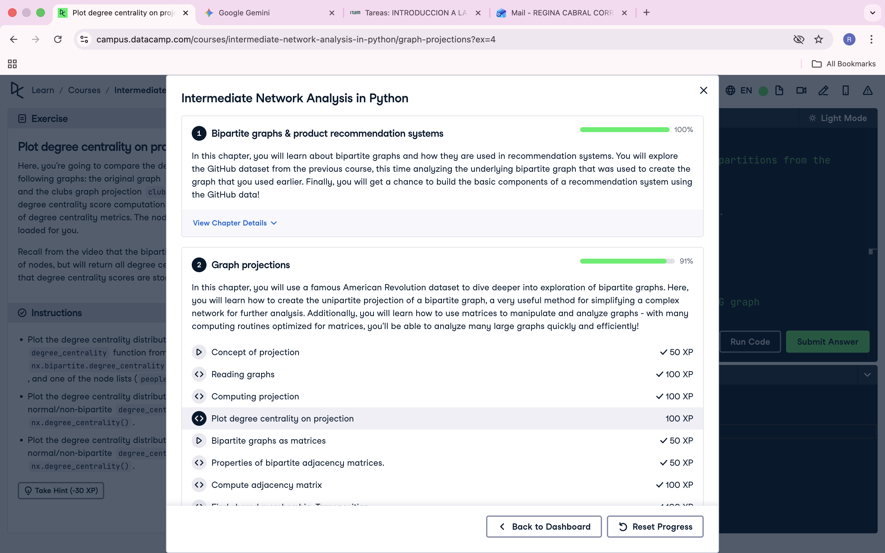

# Evidencia: Intermediate Network Analysis in Python

Nombre del Estudiante: Regina Cabral Corres
Fecha: 25/02/2026

## Prueba de Finalización

Por favor, inserta aquí abajo una captura de pantalla clara donde se vea:
1.  El nombre del curso.
2.  El progreso al 100%
3.  Tu usuario logueado.

```markdown

```